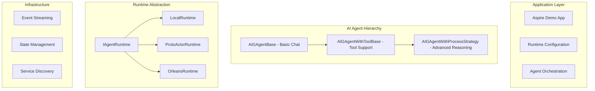

# Aevatar Agent Framework - System Specification

## 🎯 Executive Summary

Based on the Aevatar Constitution, we will build a multi-runtime agent system with hierarchical AI capabilities. The system will provide out-of-the-box support for Local, ProtoActor, and Orleans runtimes, with a progressive AI agent inheritance chain that enables simple chatbots to evolve into sophisticated reasoning engines.

## 📐 Architecture Overview

### Core Architecture Layers



## 🏗️ Component Specifications

### 1. Runtime Abstraction Layer

#### `IAgentRuntime` Interface
```csharp
namespace Aevatar.Agents.Runtime;

public interface IAgentRuntime
{
    string RuntimeType { get; }
    Task<IAgentHost> CreateHostAsync(AgentHostConfiguration config);
    Task<TAgent> SpawnAgentAsync<TAgent>(AgentSpawnOptions options) 
        where TAgent : GAgentBase;
    Task<bool> IsHealthyAsync();
    Task ShutdownAsync();
}

public class AgentHostConfiguration
{
    public string HostName { get; set; }
    public int Port { get; set; }
    public Dictionary<string, object> RuntimeSpecificSettings { get; set; }
    public ServiceDiscoveryOptions Discovery { get; set; }
    public StreamingOptions Streaming { get; set; }
}
```

#### Runtime Implementations

##### LocalRuntime
```csharp
public class LocalRuntime : IAgentRuntime
{
    // In-memory execution, no network overhead
    // Perfect for development and testing
    public override async Task<IAgentHost> CreateHostAsync(AgentHostConfiguration config)
    {
        return new LocalAgentHost(
            streamRegistry: new LocalMessageStreamRegistry(),
            actorManager: new LocalGAgentActorManager()
        );
    }
}
```

##### ProtoActorRuntime
```csharp
public class ProtoActorRuntime : IAgentRuntime
{
    // Lightweight actors with gRPC communication
    public override async Task<IAgentHost> CreateHostAsync(AgentHostConfiguration config)
    {
        var system = new ActorSystem();
        var remote = new Remote(system, RemoteConfig.Default);
        await remote.StartAsync();
        
        return new ProtoActorAgentHost(system, remote);
    }
}
```

##### OrleansRuntime
```csharp
public class OrleansRuntime : IAgentRuntime
{
    // Virtual actors with automatic clustering
    public override async Task<IAgentHost> CreateHostAsync(AgentHostConfiguration config)
    {
        var siloHost = new HostBuilder()
            .UseOrleans(builder => {
                builder.UseLocalhostClustering()
                       .AddMemoryStreams("AevatarStreams")
                       .AddMemoryGrainStorage("AgentState");
            })
            .Build();
            
        await siloHost.StartAsync();
        return new OrleansAgentHost(siloHost);
    }
}
```

### 2. AI Agent Hierarchy

#### Level 1: AIGAgentBase - Basic Chat
```csharp
namespace Aevatar.Agents.AI;

public abstract class AIGAgentBase<TState> : GAgentBase<TState>
    where TState : class, IMessage, new()
{
    private readonly ILLMProvider _llmProvider;
    private readonly IConversationManager _conversation;
    
    protected string SystemPrompt { get; set; }
    
    protected AIGAgentBase(AIAgentConfiguration config)
    {
        _llmProvider = config.LLMProvider;
        _conversation = new ConversationManager(config.MaxHistory);
        SystemPrompt = config.SystemPrompt;
    }
    
    // Core chat abstraction
    protected virtual async Task<ChatResponse> ChatAsync(ChatRequest request)
    {
        // Add to conversation history
        _conversation.AddUserMessage(request.Message);
        
        // Build LLM request
        var llmRequest = new AevatarLLMRequest
        {
            SystemPrompt = SystemPrompt,
            Messages = _conversation.GetHistory(),
            Settings = GetLLMSettings()
        };
        
        // Get response
        var response = await _llmProvider.GenerateAsync(llmRequest);
        
        // Add to history and return
        _conversation.AddAssistantMessage(response.Content);
        return new ChatResponse { Content = response.Content };
    }
    
    // Event handler for chat events
    [EventHandler]
    protected virtual async Task HandleChatEvent(ChatRequestEvent evt)
    {
        var response = await ChatAsync(new ChatRequest { Message = evt.Message });
        await PublishAsync(new ChatResponseEvent 
        { 
            Content = response.Content,
            RequestId = evt.RequestId 
        });
    }
}

// Chat abstractions
public interface IConversationManager
{
    void AddUserMessage(string message);
    void AddAssistantMessage(string message);
    void AddSystemMessage(string message);
    List<AevatarChatMessage> GetHistory();
    void ClearHistory();
}

public class ChatRequest
{
    public string Message { get; set; }
    public Dictionary<string, object> Context { get; set; }
}

public class ChatResponse
{
    public string Content { get; set; }
    public TokenUsage Usage { get; set; }
}
```

#### Level 2: AIGAgentWithToolBase - Tool Support
```csharp
public abstract class AIGAgentWithToolBase<TState> : AIGAgentBase<TState>
    where TState : class, IMessage, new()
{
    private readonly IAevatarToolManager _toolManager;
    
    protected AIGAgentWithToolBase(AIAgentConfiguration config) : base(config)
    {
        _toolManager = new AevatarToolManager();
        RegisterTools();
    }
    
    // Tool registration hook
    protected abstract void RegisterTools();
    
    // Helper method to register a tool
    protected void RegisterTool(AevatarTool tool)
    {
        _toolManager.RegisterToolAsync(tool).Wait();
    }
    
    // Override chat to include function calling
    protected override async Task<ChatResponse> ChatAsync(ChatRequest request)
    {
        _conversation.AddUserMessage(request.Message);
        
        var llmRequest = new AevatarLLMRequest
        {
            SystemPrompt = SystemPrompt,
            Messages = _conversation.GetHistory(),
            Settings = GetLLMSettings(),
            Functions = await _toolManager.GenerateAevatarFunctionDefinitionsAsync()
        };
        
        var response = await _llmProvider.GenerateAsync(llmRequest);
        
        // Handle function calls
        if (response.AevatarFunctionCall != null)
        {
            var toolResult = await ExecuteToolAsync(
                response.AevatarFunctionCall.Name,
                response.AevatarFunctionCall.Arguments
            );
            
            _conversation.AddFunctionMessage(
                response.AevatarFunctionCall.Name,
                toolResult.ToString()
            );
            
            // Recursive call to get final response
            return await ChatAsync(request);
        }
        
        _conversation.AddAssistantMessage(response.Content);
        return new ChatResponse { Content = response.Content };
    }
    
    protected async Task<object> ExecuteToolAsync(string toolName, string arguments)
    {
        var parameters = JsonSerializer.Deserialize<Dictionary<string, object>>(arguments);
        var result = await _toolManager.ExecuteToolAsync(toolName, parameters);
        return result.Result;
    }
}
```

#### Level 3: AIGAgentWithProcessStrategy - Advanced Processing
```csharp
public abstract class AIGAgentWithProcessStrategy<TState> : AIGAgentWithToolBase<TState>
    where TState : class, IMessage, new()
{
    private readonly Dictionary<string, IProcessingStrategy> _strategies;
    
    protected AIGAgentWithProcessStrategy(AIAgentConfiguration config) : base(config)
    {
        _strategies = new Dictionary<string, IProcessingStrategy>
        {
            ["standard"] = new StandardProcessingStrategy(_llmProvider),
            ["chain-of-thought"] = new ChainOfThoughtStrategy(_llmProvider),
            ["react"] = new ReActStrategy(_llmProvider, _toolManager),
            ["tree-of-thoughts"] = new TreeOfThoughtsStrategy(_llmProvider)
        };
    }
    
    // Strategy selection hook
    protected virtual string SelectStrategy(ChatRequest request)
    {
        // Default implementation - can be overridden
        if (request.Context?.ContainsKey("strategy") == true)
            return request.Context["strategy"].ToString();
            
        // Auto-detect based on complexity
        if (RequiresReasoning(request.Message))
            return "chain-of-thought";
        if (RequiresToolUse(request.Message))
            return "react";
            
        return "standard";
    }
    
    protected override async Task<ChatResponse> ChatAsync(ChatRequest request)
    {
        var strategyName = SelectStrategy(request);
        var strategy = _strategies[strategyName];
        
        var context = new ProcessingContext
        {
            Conversation = _conversation,
            Tools = _toolManager,
            SystemPrompt = SystemPrompt,
            Request = request
        };
        
        var result = await strategy.ProcessAsync(context);
        
        _conversation.AddAssistantMessage(result.FinalResponse);
        
        return new ChatResponse 
        { 
            Content = result.FinalResponse,
            ProcessingSteps = result.Steps
        };
    }
}

// Strategy abstraction
public interface IProcessingStrategy
{
    Task<ProcessingResult> ProcessAsync(ProcessingContext context);
}

public class ProcessingContext
{
    public IConversationManager Conversation { get; set; }
    public IAevatarToolManager Tools { get; set; }
    public string SystemPrompt { get; set; }
    public ChatRequest Request { get; set; }
}

public class ProcessingResult
{
    public string FinalResponse { get; set; }
    public List<ProcessingStep> Steps { get; set; }
}
```

### 3. Aspire Demo Application

#### Project Structure
```
examples/
  Aevatar.Agents.Aspire/
    ├── Aevatar.Agents.Aspire.AppHost/
    │   ├── Program.cs
    │   └── appsettings.json
    ├── Aevatar.Agents.Aspire.ServiceDefaults/
    │   └── Extensions.cs
    └── Aevatar.Agents.Aspire.Agents/
        ├── CustomerServiceAgent.cs
        ├── DataAnalysisAgent.cs
        └── OrchestratorAgent.cs
```

#### AppHost Configuration
```csharp
// Program.cs
var builder = DistributedApplication.CreateBuilder(args);

// Configure runtime based on environment
var runtime = builder.Configuration["AgentRuntime"] switch
{
    "Orleans" => builder.AddOrleans("orleans-cluster")
                       .WithDashboard(),
    "ProtoActor" => builder.AddProtoActor("proto-cluster"),
    _ => builder.AddLocalRuntime("local")
};

// Add AI services
builder.AddAzureOpenAI("openai")
       .AddDeployment("gpt-4");

// Add vector database for memory
builder.AddQdrant("vectordb");

// Add agents
var customerService = builder.AddAgentProject<CustomerServiceAgent>("customer-agent")
    .WithReference(runtime)
    .WithReference("openai");

var dataAnalysis = builder.AddAgentProject<DataAnalysisAgent>("analysis-agent")
    .WithReference(runtime)
    .WithReference("openai")
    .WithReference("vectordb");

var orchestrator = builder.AddAgentProject<OrchestratorAgent>("orchestrator")
    .WithReference(runtime)
    .WithReference(customerService)
    .WithReference(dataAnalysis);

// Add API frontend
builder.AddProject<Projects.Aevatar_Agents_Aspire_Api>("api")
    .WithReference(orchestrator);

await builder.Build().RunAsync();
```

#### Agent Implementations

##### Simple Chat Agent
```csharp
public class CustomerServiceAgent : AIGAgentBase<CustomerServiceState>
{
    protected override void ConfigureAI(AIAgentConfiguration config)
    {
        config.SystemPrompt = @"
            You are a helpful customer service agent.
            Be polite, professional, and solution-oriented.
            Always try to understand the customer's issue before providing solutions.
        ";
        config.MaxHistory = 20;
        config.Model = "gpt-4";
    }
    
    [EventHandler]
    public async Task HandleCustomerInquiry(CustomerInquiryEvent evt)
    {
        var response = await ChatAsync(new ChatRequest 
        { 
            Message = evt.Question,
            Context = new() { ["customerId"] = evt.CustomerId }
        });
        
        await PublishAsync(new CustomerResponseEvent
        {
            CustomerId = evt.CustomerId,
            Response = response.Content
        });
    }
}
```

##### Tool-Enabled Agent
```csharp
public class DataAnalysisAgent : AIGAgentWithToolBase<DataAnalysisState>
{
    protected override void RegisterTools()
    {
        RegisterTool(new SqlQueryTool(_database));
        RegisterTool(new ChartGeneratorTool(_chartService));
        RegisterTool(new ExportTool(_exportService));
    }
    
    protected override void ConfigureAI(AIAgentConfiguration config)
    {
        config.SystemPrompt = @"
            You are a data analysis expert.
            Use the available tools to query data, generate visualizations, and export results.
            Always validate data before presenting conclusions.
        ";
    }
}
```

##### Advanced Strategy Agent
```csharp
public class OrchestratorAgent : AIGAgentWithProcessStrategy<OrchestratorState>
{
    protected override string SelectStrategy(ChatRequest request)
    {
        // Complex requests use tree-of-thoughts
        if (IsComplexRequest(request))
            return "tree-of-thoughts";
            
        // Multi-step tasks use ReAct
        if (RequiresMultipleSteps(request))
            return "react";
            
        // Analytical tasks use chain-of-thought
        if (RequiresAnalysis(request))
            return "chain-of-thought";
            
        return "standard";
    }
    
    protected override void RegisterTools()
    {
        RegisterTool(new DelegateToAgentTool(_agentManager));
        RegisterTool(new AggregateResultsTool());
        RegisterTool(new GenerateReportTool());
    }
}
```

### 4. Configuration System

#### Runtime Configuration
```yaml
# appsettings.yaml
AgentRuntime:
  Type: Orleans  # Local | ProtoActor | Orleans
  
  Local:
    MaxAgents: 1000
    
  ProtoActor:
    ClusterProvider: Consul
    RemoteConfig:
      Host: localhost
      Port: 8080
      
  Orleans:
    ClusteringProvider: AzureStorage
    StreamProvider: EventHub
    PersistenceProvider: CosmosDB
    Dashboard: true
    
AI:
  Provider: AzureOpenAI
  Endpoint: https://myinstance.openai.azure.com
  Model: gpt-4
  MaxTokens: 4000
  Temperature: 0.7
  
Memory:
  VectorStore: Qdrant
  Endpoint: http://localhost:6333
  Collection: agent-memories
```

### 5. Out-of-the-Box Features

#### Automatic Service Registration
```csharp
public static class ServiceCollectionExtensions
{
    public static IServiceCollection AddAevatarAgents(
        this IServiceCollection services,
        IConfiguration configuration)
    {
        // Auto-detect and register runtime
        var runtimeType = configuration["AgentRuntime:Type"];
        services.AddSingleton<IAgentRuntime>(provider =>
        {
            return runtimeType switch
            {
                "Orleans" => new OrleansRuntime(configuration),
                "ProtoActor" => new ProtoActorRuntime(configuration),
                _ => new LocalRuntime(configuration)
            };
        });
        
        // Register AI services
        services.AddSingleton<ILLMProvider, AzureOpenAIProvider>();
        services.AddSingleton<IAevatarToolManager, AevatarToolManager>();
        services.AddSingleton<IAevatarMemory, QdrantMemory>();
        
        // Register agent factory
        services.AddSingleton<IAgentFactory, UniversalAgentFactory>();
        
        // Health checks
        services.AddHealthChecks()
                .AddCheck<AgentRuntimeHealthCheck>("agent-runtime")
                .AddCheck<AIServiceHealthCheck>("ai-service");
                
        return services;
    }
}
```

#### Universal Agent Factory
```csharp
public class UniversalAgentFactory : IAgentFactory
{
    private readonly IAgentRuntime _runtime;
    private readonly IServiceProvider _services;
    
    public async Task<TAgent> CreateAgentAsync<TAgent>(string agentId = null)
        where TAgent : GAgentBase, new()
    {
        // Create agent instance
        var agent = new TAgent();
        
        // Inject dependencies if AI agent
        if (agent is AIGAgentBase aiAgent)
        {
            var config = new AIAgentConfiguration
            {
                LLMProvider = _services.GetRequiredService<ILLMProvider>(),
                // ... other config
            };
            await aiAgent.InitializeAsync(config);
        }
        
        // Spawn in runtime
        var options = new AgentSpawnOptions
        {
            AgentId = agentId ?? Guid.NewGuid().ToString(),
            EnablePersistence = true
        };
        
        return await _runtime.SpawnAgentAsync<TAgent>(options);
    }
}
```

### 6. Migration Path

For existing codebases:

#### Phase 1: Refactor AI Base Classes
```bash
# Move files
mv AevatarAIAgentBase.cs AIGAgentBase.cs

# Split into hierarchy
extract AIGAgentBase.ChatAsync -> IConversationManager
extract AIGAgentBase.Tools -> AIGAgentWithToolBase
extract AIGAgentBase.Strategies -> AIGAgentWithProcessStrategy
```

#### Phase 2: Implement Runtime Abstraction
```bash
# Create runtime packages
dotnet new classlib -n Aevatar.Agents.Runtime
dotnet new classlib -n Aevatar.Agents.Runtime.Local
dotnet new classlib -n Aevatar.Agents.Runtime.Orleans
dotnet new classlib -n Aevatar.Agents.Runtime.ProtoActor
```

#### Phase 3: Create Aspire Demo
```bash
# Create Aspire solution
dotnet new aspire -n Aevatar.Agents.Aspire
cd Aevatar.Agents.Aspire

# Add agent projects
dotnet new classlib -n Aevatar.Agents.Aspire.Agents
dotnet add reference ../../src/Aevatar.Agents.AI
```

### 7. Testing Strategy

#### Unit Tests
```csharp
[TestClass]
public class AIAgentHierarchyTests
{
    [TestMethod]
    public async Task BasicAgent_CanChat()
    {
        var agent = new TestChatAgent();
        var response = await agent.ChatAsync(new ChatRequest { Message = "Hello" });
        Assert.IsNotNull(response.Content);
    }
    
    [TestMethod]
    public async Task ToolAgent_CanExecuteTools()
    {
        var agent = new TestToolAgent();
        agent.RegisterTestTool();
        var response = await agent.ChatAsync(new ChatRequest 
        { 
            Message = "Execute test tool" 
        });
        Assert.IsTrue(response.Content.Contains("Tool executed"));
    }
    
    [TestMethod]
    public async Task StrategyAgent_SelectsCorrectStrategy()
    {
        var agent = new TestStrategyAgent();
        var response = await agent.ChatAsync(new ChatRequest 
        { 
            Message = "Solve this step by step",
            Context = new() { ["strategy"] = "chain-of-thought" }
        });
        Assert.IsTrue(response.ProcessingSteps.Any(s => s.Type == "reasoning"));
    }
}
```

#### Integration Tests
```csharp
[TestClass]
public class RuntimeIntegrationTests
{
    [DataTestMethod]
    [DataRow("Local")]
    [DataRow("ProtoActor")]
    [DataRow("Orleans")]
    public async Task Agent_RunsInAllRuntimes(string runtimeType)
    {
        var runtime = CreateRuntime(runtimeType);
        var host = await runtime.CreateHostAsync(new AgentHostConfiguration());
        
        var agent = await runtime.SpawnAgentAsync<TestAgent>(new AgentSpawnOptions());
        Assert.IsNotNull(agent);
        
        await agent.PublishAsync(new TestEvent());
        await Task.Delay(100);
        
        Assert.IsTrue(agent.State.EventReceived);
    }
}
```

### 8. Performance Targets

Based on Constitution Article XI:

| Metric | Target | Measurement Method |
|--------|--------|-------------------|
| Agent Spawn Rate | > 10,000/second | Benchmark tool |
| Event Throughput | > 1M events/second/node | Load test |
| Chat Latency | < 100ms (cached) | P95 latency |
| Tool Execution | < 500ms | P95 latency |
| Memory per Agent | < 1MB | Memory profiler |

### 9. Documentation Structure

```
docs/
  ├── getting-started/
  │   ├── quickstart.md
  │   ├── first-agent.md
  │   └── runtime-selection.md
  ├── ai-agents/
  │   ├── basic-chat.md
  │   ├── adding-tools.md
  │   └── processing-strategies.md
  ├── runtimes/
  │   ├── local.md
  │   ├── orleans.md
  │   └── protoactor.md
  └── aspire/
      ├── setup.md
      ├── configuration.md
      └── deployment.md
```

### 10. Implementation Timeline

#### Week 1-2: Core Refactoring
- [ ] Refactor AI agent hierarchy
- [ ] Extract conversation management
- [ ] Implement processing strategies

#### Week 3-4: Runtime Abstraction
- [ ] Define IAgentRuntime interface
- [ ] Implement LocalRuntime
- [ ] Implement ProtoActorRuntime
- [ ] Implement OrleansRuntime

#### Week 5-6: Aspire Demo
- [ ] Create Aspire project structure
- [ ] Implement sample agents
- [ ] Add runtime switching
- [ ] Create deployment configs

#### Week 7-8: Testing & Documentation
- [ ] Unit tests for all components
- [ ] Integration tests for runtimes
- [ ] Performance benchmarks
- [ ] Complete documentation

## 🚀 Success Criteria

1. **Single Line Setup**: Developers can start with `dotnet new aevatar-agent`
2. **Runtime Agnostic**: Same agent code runs on all three runtimes
3. **Progressive Complexity**: Simple agents stay simple, complex agents are possible
4. **Production Ready**: Health checks, metrics, and observability built-in
5. **AI First**: Every agent can become an AI agent with one line of config

## 📝 Next Steps

1. Review and approve specification
2. Create feature branches for each component
3. Implement in parallel following the timeline
4. Weekly sync on progress and blockers
5. Beta release with Aspire demo

---

*Specification Version: 1.0.0*
*Based on Constitution v1.0.0*
*Date: 2024-01*
