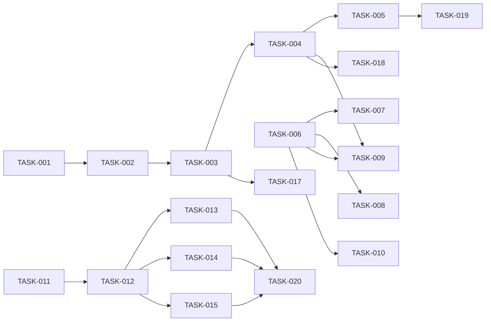

# Aevatar Agent Framework - Task Breakdown

## 🚀 Current Sprint Tasks (Week 1-2)

### 🔴 Critical Path - AI Agent Hierarchy Refactoring

#### TASK-001: Create IConversationManager Interface
**Priority**: P0 - Blocker
**Estimated**: 4 hours
**Dependencies**: None
**Assignee**: TBD

```csharp
// Location: src/Aevatar.Agents.AI.Core/Abstractions/IConversationManager.cs
public interface IConversationManager
{
    void AddUserMessage(string message);
    void AddAssistantMessage(string message); 
    void AddSystemMessage(string message);
    void AddFunctionMessage(string functionName, string result);
    List<AevatarChatMessage> GetHistory();
    List<AevatarChatMessage> GetHistory(int maxMessages);
    void ClearHistory();
    int MessageCount { get; }
}
```

**Acceptance Criteria**:
- [ ] Interface defined with all methods
- [ ] AevatarChatMessage protobuf defined
- [ ] XML documentation on all methods
- [ ] Unit test interface created

---

#### TASK-002: Implement ConversationManager
**Priority**: P0 - Blocker  
**Estimated**: 6 hours
**Dependencies**: TASK-001
**Assignee**: TBD

```csharp
// Location: src/Aevatar.Agents.AI.Core/Conversation/ConversationManager.cs
public class ConversationManager : IConversationManager
{
    private readonly List<AevatarChatMessage> _messages;
    private readonly int _maxHistory;
    // Implementation...
}
```

**Acceptance Criteria**:
- [ ] Thread-safe implementation
- [ ] Respects max history limit
- [ ] Automatic role assignment
- [ ] Token counting support
- [ ] 90% test coverage

---

#### TASK-003: Refactor AevatarAIAgentBase to AIGAgentBase
**Priority**: P0 - Critical
**Estimated**: 8 hours
**Dependencies**: TASK-002
**Assignee**: TBD

**Implementation Steps**:
1. Rename class to AIGAgentBase
2. Extract tool functionality
3. Extract strategy functionality  
4. Implement basic ChatAsync method
5. Add system prompt configuration
6. Update event handlers

**Acceptance Criteria**:
- [ ] Basic chat working with mock LLM
- [ ] System prompt configuration
- [ ] Event handler for ChatRequestEvent
- [ ] State persistence working
- [ ] Backward compatibility maintained

---

#### TASK-004: Create AIGAgentWithToolBase
**Priority**: P1 - High
**Estimated**: 6 hours
**Dependencies**: TASK-003
**Assignee**: TBD

```csharp
// Location: src/Aevatar.Agents.AI.Core/AIGAgentWithToolBase.cs
public abstract class AIGAgentWithToolBase<TState> : AIGAgentBase<TState>
{
    protected abstract void RegisterTools();
    protected void RegisterTool(AevatarTool tool);
    // Tool execution logic
}
```

**Acceptance Criteria**:
- [ ] Tool registration mechanism
- [ ] Function calling in ChatAsync
- [ ] Tool execution with error handling
- [ ] Tool result formatting
- [ ] Integration test with sample tool

---

#### TASK-005: Create AIGAgentWithProcessStrategy
**Priority**: P1 - High
**Estimated**: 8 hours
**Dependencies**: TASK-004
**Assignee**: TBD

```csharp
// Location: src/Aevatar.Agents.AI.Core/AIGAgentWithProcessStrategy.cs
public abstract class AIGAgentWithProcessStrategy<TState> : AIGAgentWithToolBase<TState>
{
    protected virtual string SelectStrategy(ChatRequest request);
    // Strategy execution
}
```

**Acceptance Criteria**:
- [ ] Strategy selection mechanism
- [ ] Strategy registration
- [ ] Override ChatAsync with strategy
- [ ] Context passing to strategies
- [ ] Strategy result aggregation

---

### 🟡 Processing Strategies Implementation

#### TASK-006: Define IProcessingStrategy Interface
**Priority**: P1 - High
**Estimated**: 2 hours
**Dependencies**: None
**Assignee**: TBD

```csharp
// Location: src/Aevatar.Agents.AI.Core/Strategies/IProcessingStrategy.cs
public interface IProcessingStrategy
{
    Task<ProcessingResult> ProcessAsync(ProcessingContext context);
    string Name { get; }
    bool CanHandle(ChatRequest request);
}
```

**Acceptance Criteria**:
- [ ] Interface with ProcessAsync
- [ ] ProcessingContext defined
- [ ] ProcessingResult defined
- [ ] Documentation complete

---

#### TASK-007: Implement StandardProcessingStrategy
**Priority**: P1 - High
**Estimated**: 4 hours
**Dependencies**: TASK-006
**Assignee**: TBD

**Implementation**:
- Simple pass-through to LLM
- No additional processing
- Basic error handling

**Acceptance Criteria**:
- [ ] Direct LLM call
- [ ] Response formatting
- [ ] Error handling
- [ ] Unit tests

---

#### TASK-008: Implement ChainOfThoughtStrategy
**Priority**: P2 - Medium
**Estimated**: 6 hours
**Dependencies**: TASK-006
**Assignee**: TBD

**Implementation**:
- Add "think step by step" prompt
- Extract reasoning steps
- Format final answer

**Acceptance Criteria**:
- [ ] Step-by-step reasoning
- [ ] Thought extraction
- [ ] Final answer synthesis
- [ ] Unit tests with examples

---

#### TASK-009: Implement ReActStrategy
**Priority**: P2 - Medium
**Estimated**: 8 hours
**Dependencies**: TASK-006, TASK-004
**Assignee**: TBD

**Implementation**:
- Reasoning + Acting loop
- Tool execution integration
- Observation processing

**Acceptance Criteria**:
- [ ] Thought-Action-Observation loop
- [ ] Tool execution in loop
- [ ] Loop termination logic
- [ ] Integration test with tools

---

#### TASK-010: Implement TreeOfThoughtsStrategy
**Priority**: P3 - Low
**Estimated**: 12 hours
**Dependencies**: TASK-006
**Assignee**: TBD

**Implementation**:
- Multiple reasoning branches
- Branch evaluation
- Best path selection

**Acceptance Criteria**:
- [ ] Branch generation
- [ ] Parallel evaluation
- [ ] Path scoring
- [ ] Performance optimization

---

### 🟢 Runtime Abstraction Layer

#### TASK-011: Create Runtime Abstraction Project
**Priority**: P0 - Blocker for Phase 2
**Estimated**: 2 hours
**Dependencies**: None
**Assignee**: TBD

```bash
dotnet new classlib -n Aevatar.Agents.Runtime
cd Aevatar.Agents.Runtime
dotnet add package Google.Protobuf
```

**Acceptance Criteria**:
- [ ] Project created
- [ ] References configured
- [ ] Build successful

---

#### TASK-012: Define IAgentRuntime Interface
**Priority**: P0 - Blocker for Phase 2
**Estimated**: 4 hours
**Dependencies**: TASK-011
**Assignee**: TBD

```csharp
// Location: src/Aevatar.Agents.Runtime/IAgentRuntime.cs
public interface IAgentRuntime
{
    string RuntimeType { get; }
    Task<IAgentHost> CreateHostAsync(AgentHostConfiguration config);
    Task<TAgent> SpawnAgentAsync<TAgent>(AgentSpawnOptions options);
    Task<bool> IsHealthyAsync();
    Task ShutdownAsync();
}
```

**Acceptance Criteria**:
- [ ] Interface defined
- [ ] Configuration classes created
- [ ] Documentation complete
- [ ] Protobuf messages defined

---

#### TASK-013: Implement LocalRuntime
**Priority**: P1 - High
**Estimated**: 8 hours
**Dependencies**: TASK-012
**Assignee**: TBD

**Implementation**:
- Integrate with LocalGAgentActorManager
- Use LocalMessageStreamRegistry
- Zero configuration defaults

**Acceptance Criteria**:
- [ ] LocalRuntime class implemented
- [ ] LocalAgentHost implemented
- [ ] Stream integration working
- [ ] Health checks implemented
- [ ] Integration test passing

---

#### TASK-014: Implement ProtoActorRuntime
**Priority**: P2 - Medium
**Estimated**: 12 hours
**Dependencies**: TASK-012
**Assignee**: TBD

**Implementation**:
- ActorSystem initialization
- Remote configuration
- Cluster support

**Acceptance Criteria**:
- [ ] ProtoActorRuntime implemented
- [ ] gRPC remote working
- [ ] Cluster provider integrated
- [ ] Health checks
- [ ] Integration test with cluster

---

#### TASK-015: Implement OrleansRuntime
**Priority**: P2 - Medium
**Estimated**: 12 hours
**Dependencies**: TASK-012
**Assignee**: TBD

**Implementation**:
- Silo host builder
- Stream provider setup
- Dashboard configuration

**Acceptance Criteria**:
- [ ] OrleansRuntime implemented
- [ ] Silo configuration working
- [ ] Streaming integrated
- [ ] Dashboard accessible
- [ ] Integration test with grains

---

### 🔵 Aspire Demo Application

#### TASK-016: Create Aspire Solution Structure
**Priority**: P1 - High for Demo
**Estimated**: 4 hours
**Dependencies**: None
**Assignee**: TBD

```bash
dotnet new aspire -n Aevatar.Agents.Aspire
cd Aevatar.Agents.Aspire
dotnet new classlib -n Aevatar.Agents.Aspire.Agents
```

**Acceptance Criteria**:
- [ ] Aspire solution created
- [ ] All projects added
- [ ] References configured
- [ ] Build successful

---

#### TASK-017: Implement CustomerServiceAgent
**Priority**: P2 - Demo
**Estimated**: 4 hours
**Dependencies**: TASK-003, TASK-016
**Assignee**: TBD

**Implementation**:
- Basic chat agent
- Customer service prompts
- State management

**Acceptance Criteria**:
- [ ] Agent class created
- [ ] System prompt configured
- [ ] Event handlers working
- [ ] State persistence
- [ ] Unit test

---

#### TASK-018: Implement DataAnalysisAgent
**Priority**: P2 - Demo
**Estimated**: 6 hours
**Dependencies**: TASK-004, TASK-016
**Assignee**: TBD

**Implementation**:
- Tool-enabled agent
- SQL query tool
- Chart generation tool

**Acceptance Criteria**:
- [ ] Agent with tools
- [ ] Tool registration
- [ ] Tool execution working
- [ ] Result formatting
- [ ] Integration test

---

#### TASK-019: Implement OrchestratorAgent
**Priority**: P3 - Demo
**Estimated**: 8 hours
**Dependencies**: TASK-005, TASK-016
**Assignee**: TBD

**Implementation**:
- Strategy-based agent
- Multi-agent coordination
- Complex reasoning

**Acceptance Criteria**:
- [ ] Strategy selection logic
- [ ] Agent delegation tool
- [ ] Result aggregation
- [ ] Performance metrics
- [ ] End-to-end test

---

#### TASK-020: Configure Runtime Switching
**Priority**: P1 - Critical for Demo
**Estimated**: 6 hours
**Dependencies**: TASK-013, TASK-014, TASK-015
**Assignee**: TBD

**Implementation**:
- Configuration-based runtime selection
- Service registration
- Health checks

**Acceptance Criteria**:
- [ ] Runtime switching via config
- [ ] All runtimes working
- [ ] Health endpoints
- [ ] Metrics collection
- [ ] Docker support

---

## 📊 Task Dependencies Graph



## 🎯 Quick Start Tasks (Can Start Immediately)

### For AI Team:
1. **TASK-001**: Create IConversationManager Interface
2. **TASK-006**: Define IProcessingStrategy Interface
3. **TASK-011**: Create Runtime Abstraction Project

### For Infrastructure Team:
1. **TASK-011**: Create Runtime Abstraction Project
2. **TASK-016**: Create Aspire Solution Structure

### For Parallel Work:
- Team A: TASK-001 → TASK-002 → TASK-003
- Team B: TASK-006 → TASK-007, TASK-008
- Team C: TASK-011 → TASK-012

## 📋 Task Assignment Template

```markdown
### Task: [TASK-XXX]
**Assigned to**: [Developer Name]
**Started**: [Date]
**Target Completion**: [Date]
**Status**: Not Started | In Progress | Review | Complete
**PR Link**: [#XXX]
**Notes**: [Any blockers or comments]
```

## ⚡ Daily Standup Questions

1. Which task(s) did you complete yesterday?
2. Which task(s) are you working on today?
3. Any blockers or dependencies?
4. Need any design decisions or clarifications?

## 🔄 Task Board States

1. **Backlog**: Not ready to start
2. **Ready**: Dependencies met, can start
3. **In Progress**: Actively being worked on
4. **In Review**: PR submitted, awaiting review
5. **Testing**: Code reviewed, in testing
6. **Done**: Merged and deployed

## 🚦 Task Prioritization

### P0 - Blockers (Must Do Now)
- TASK-001, TASK-002, TASK-003
- TASK-011, TASK-012

### P1 - Critical Path (This Sprint)
- TASK-004, TASK-005, TASK-006, TASK-007
- TASK-013, TASK-016, TASK-020

### P2 - Important (Next Sprint)
- TASK-008, TASK-009
- TASK-014, TASK-015
- TASK-017, TASK-018

### P3 - Nice to Have
- TASK-010, TASK-019

## 📝 Code Review Checklist

- [ ] Follows CONSTITUTION principles
- [ ] Protobuf for all serializable types
- [ ] Unit tests included (80% coverage)
- [ ] Documentation updated
- [ ] No breaking changes
- [ ] Performance benchmarked
- [ ] Security reviewed
- [ ] Integration tests passing

## 🎁 Task Completion Rewards

- **5 Tasks**: Team coffee/lunch
- **10 Tasks**: Half-day hackathon
- **20 Tasks**: Team celebration
- **All Phase 1**: Bonus allocation

---

*Task List Version: 1.0.0*
*Total Tasks: 20*
*Estimated Hours: ~150*
*Team Size Needed: 2-4 developers*
*Sprint Duration: 2 weeks*
