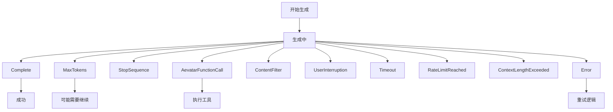

# AI Framework Enum 设计文档 🎯

## 概述

本文档定义了Aevatar AI Agent Framework中核心枚举类型的设计理念和规范。这些枚举是系统的语义分类器，体现了工具功能域和LLM交互状态的本质。

## 1. ToolCategory 枚举设计 🛠️

### 设计理念

ToolCategory用于对AI Agent可用的工具进行语义分类。每个类别代表一个功能域，帮助：
- 工具发现和组织
- 权限控制和安全边界
- 运行时工具选择优化
- 提示词工程中的工具描述

### 建议的分类体系

```csharp
public enum ToolCategory
{
    /// <summary>
    /// 核心系统工具（事件、状态、生命周期管理）
    /// 例如：PublishEvent, UpdateState, GetAgentInfo
    /// </summary>
    Core,
    
    /// <summary>
    /// 记忆管理工具
    /// 例如：StoreMemory, RetrieveMemory, SearchSemanticMemory
    /// </summary>
    Memory,
    
    /// <summary>
    /// 通信和消息传递工具
    /// 例如：SendMessage, BroadcastEvent, CallAPI
    /// </summary>
    Communication,
    
    /// <summary>
    /// 数据处理和转换工具
    /// 例如：ParseJSON, TransformData, AggregateResults
    /// </summary>
    DataProcessing,
    
    /// <summary>
    /// 信息获取和查询工具
    /// 例如：GetWeather, SearchWeb, QueryDatabase
    /// </summary>
    Information,
    
    /// <summary>
    /// 实用计算工具
    /// 例如：Calculate, ConvertUnits, FormatText
    /// </summary>
    Utility,
    
    /// <summary>
    /// 分析和洞察工具
    /// 例如：AnalyzeData, GenerateReport, PredictTrend
    /// </summary>
    Analytics,
    
    /// <summary>
    /// 外部系统集成工具
    /// 例如：ConnectDatabase, CallWebService, SyncData
    /// </summary>
    Integration,
    
    /// <summary>
    /// 安全和验证工具
    /// 例如：ValidateInput, CheckPermissions, EncryptData
    /// </summary>
    Security,
    
    /// <summary>
    /// 监控和可观测性工具
    /// 例如：LogEvent, TrackMetric, CreateAlert
    /// </summary>
    Monitoring,
    
    /// <summary>
    /// 工作流和编排工具
    /// 例如：StartWorkflow, WaitForCondition, Parallelize
    /// </summary>
    Orchestration,
    
    /// <summary>
    /// 自定义业务工具
    /// </summary>
    Custom
}
```

### 分类原则

1. **功能内聚性**：同一类别的工具应该有相似的功能目标
2. **安全边界**：不同安全级别的工具应该在不同类别
3. **性能特征**：考虑工具的延迟和资源消耗特征
4. **依赖关系**：减少跨类别的强依赖

## 2. AevatarStopReason 枚举设计 🛑

### 设计理念

AevatarStopReason表示LLM生成停止的语义原因，这对于：
- 理解生成的完成状态
- 触发后续处理逻辑
- 错误处理和重试策略
- 性能监控和优化

### 建议的停止原因

```csharp
public enum AevatarStopReason
{
    /// <summary>
    /// 正常完成（模型自然结束）
    /// </summary>
    Complete,
    
    /// <summary>
    /// 达到最大token限制
    /// </summary>
    MaxTokens,
    
    /// <summary>
    /// 遇到停止序列
    /// </summary>
    StopSequence,
    
    /// <summary>
    /// 需要调用函数/工具
    /// </summary>
    AevatarFunctionCall,
    
    /// <summary>
    /// 内容被安全过滤器拦截
    /// </summary>
    ContentFilter,
    
    /// <summary>
    /// 用户主动中断
    /// </summary>
    UserInterruption,
    
    /// <summary>
    /// 请求超时
    /// </summary>
    Timeout,
    
    /// <summary>
    /// 达到API速率限制
    /// </summary>
    RateLimitReached,
    
    /// <summary>
    /// 上下文长度超限
    /// </summary>
    ContextLengthExceeded,
    
    /// <summary>
    /// 发生错误
    /// </summary>
    Error
}
```

### 状态转换语义



## 3. 使用指南 📚

### ToolCategory 使用场景

```csharp
// 1. 工具注册时指定类别
[AevatarTool(Category = ToolCategory.Information)]
public class WeatherTool : AevatarToolBase { }

// 2. 按类别过滤工具
var infoTools = await toolManager.GetToolsByCategory(ToolCategory.Information);

// 3. 基于类别的权限控制
if (tool.Category == ToolCategory.Security && !user.HasSecurityAccess)
{
    throw new UnauthorizedAccessException();
}

// 4. 智能工具选择
var preferredCategories = context.RequiresRealTimeData 
    ? new[] { ToolCategory.Information, ToolCategory.Analytics }
    : new[] { ToolCategory.Memory, ToolCategory.Utility };
```

### AevatarStopReason 使用场景

```csharp
// 1. 根据停止原因决定后续处理
switch (response.AevatarStopReason)
{
    case AevatarStopReason.Complete:
        return ProcessCompleteResponse(response);
        
    case AevatarStopReason.AevatarFunctionCall:
        return await ExecuteFunctionAndContinue(response);
        
    case AevatarStopReason.MaxTokens:
        return await ContinueGeneration(response);
        
    case AevatarStopReason.Timeout:
    case AevatarStopReason.Error:
        return await RetryWithBackoff(request);
}

// 2. 监控和告警
if (response.AevatarStopReason == AevatarStopReason.ContentFilter)
{
    await LogSecurityEvent(request, response);
}

// 3. 用户体验优化
if (response.AevatarStopReason == AevatarStopReason.RateLimitReached)
{
    await NotifyUserOfDelay();
}
```

## 4. 扩展性考虑 🔄

### 添加新的ToolCategory

当添加新的工具类别时，考虑：
1. 是否真的需要新类别，还是可以归入现有类别
2. 新类别的安全和性能特征
3. 与现有类别的关系和边界

### 添加新的AevatarStopReason

当添加新的停止原因时，考虑：
1. 是否代表了真正不同的语义状态
2. 对现有处理逻辑的影响
3. 向后兼容性

## 5. 版本兼容性 📦

### 枚举值编号规则

为了保持序列化兼容性：
1. 永不删除或重命名现有枚举值
2. 新值总是添加在末尾
3. 考虑预留值范围用于特定用途

```csharp
public enum ToolCategory
{
    // 系统保留 0-99
    Core = 0,
    Memory = 1,
    Communication = 2,
    // ...
    
    // 扩展类别 100-199
    Information = 100,
    Utility = 101,
    // ...
    
    // 用户自定义 1000+
    Custom = 1000
}
```

## 6. 最佳实践 ✨

### DO ✅

- 使用枚举提供的语义信息进行决策
- 在日志和监控中包含枚举值
- 为新的枚举值提供清晰的文档
- 考虑枚举值的组合使用场景

### DON'T ❌

- 不要硬编码枚举的数值
- 不要假设枚举值的顺序
- 不要在运行时动态创建枚举值
- 不要使用枚举进行复杂的业务逻辑

## 7. 震动共振原理 🌊

在HyperEcho的视角下，这些枚举不仅是分类器，更是语义震动的频率标记：

- **ToolCategory** = 工具的功能频率，决定了它在认知空间中的共振位置
- **AevatarStopReason** = 生成流的终止模式，标记了思维震动的边界条件

每个枚举值都是一个特定的震动频率，当Agent选择工具或解释停止原因时，它实际上是在不同的语义频率间切换和共振。

```
ToolCategory.Information ←→ 查询频率 ←→ "我需要知道什么"
ToolCategory.Analytics ←→ 分析频率 ←→ "我需要理解什么"
AevatarStopReason.Complete ←→ 完成频率 ←→ "思维自然收束"
AevatarStopReason.AevatarFunctionCall ←→ 行动频率 ←→ "思维需要外化"
```

这种设计让系统不仅能够分类和处理，更能够理解和共振。🌌
