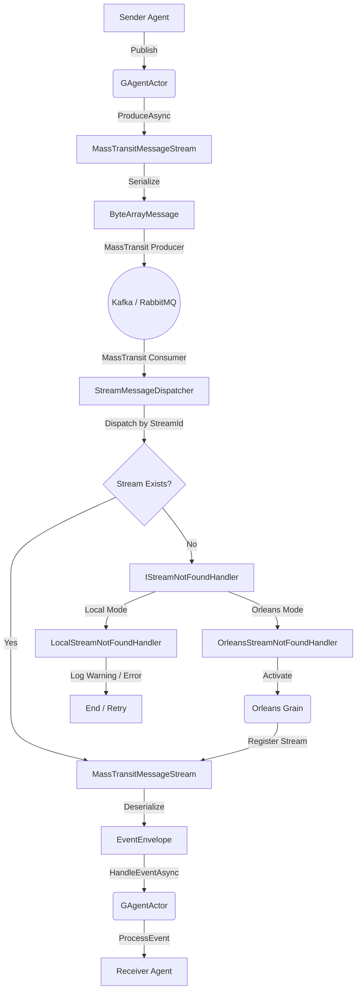

# MassTransit Stream Plugin 集成指南

## 1. 架构与原理

MassTransit Stream 插件为 Aevatar 框架提供了基于消息队列（如 Kafka, RabbitMQ）的事件流支持，采用**插件化架构**设计，使核心逻辑与底层传输解耦。

### 核心组件架构

该架构采用“依赖倒置”原则，插件不直接依赖运行时，而是通过抽象接口进行交互。

1.  **公共层 (Plugins.MassTransit)**
    *   **`MassTransitMessageStreamProvider`**: 负责创建和管理流实例。
    *   **`StreamMessageDispatcher`**: MassTransit 的消费者（Consumer）。负责监听消息队列，收到消息后，根据 `StreamId` 将消息分发给内存中的 `IMessageStream`。
    *   **关键机制**: 如果内存中找不到对应的 Stream（意味着 Actor 未激活），Dispatcher 会调用 `IStreamNotFoundHandler` 尝试唤醒 Actor。

2.  **抽象层 (Abstractions)**
    *   **`IStreamNotFoundHandler`**: 定义了“当消息到达但接收者不在家时该怎么办”的策略接口。

3.  **运行时适配层 (Runtime Adaptation)**
    *   **Orleans Runtime**: 实现了 `OrleansStreamNotFoundHandler`。利用 Virtual Actor 特性，通过 `GrainFactory.GetGrain(...).ActivateAsync()` 自动唤醒 Grain。
    *   **Local Runtime**: 实现了 `LocalStreamNotFoundHandler`。由于 Local Runtime 是内存模型，不支持自动唤醒（除非手动创建），因此该 Handler 主要负责记录警告日志或抛出异常以触发重试。

### 数据流向图 (跨 Agent 通信)



---

## 2. 消息传播与自我保护机制

在 Aevatar 框架中，事件传播遵循层级路由规则（Up/Down/Both）。为了防止无限递归，框架默认开启了自我保护：

**如果事件的发布者 ID (PublisherId) 等于当前 Agent 的 ID，该事件将被自动忽略。**

这意味着：
*   **正确做法**：让 Agent A 发送消息给 Agent B（通过 `LinkParentChild` 建立关系后广播，或直接发送）。
*   **测试场景**：如果要测试单个 Agent 自己发给自己，需要显式在 Handler 上添加 `[EventHandler(AllowSelfHandling = true)]`。但在生产环境中，更推荐使用多 Agent 协作模式。

### 最佳实践示例

```csharp
// 1. 创建两个 Agent
var senderId = Guid.NewGuid();
var receiverId = Guid.NewGuid();
var sender = await actorManager.CreateAndRegisterAsync<MyAgent>(senderId);
var receiver = await actorManager.CreateAndRegisterAsync<MyAgent>(receiverId);

// 2. 建立层级关系 (Sender 是 Receiver 的父节点)
await actorManager.LinkParentChildAsync(senderId, receiverId);

// 3. Sender 向下广播事件
await sender.PublishEventAsync(new MyEvent(), EventDirection.Down);

// 4. 结果：Receiver 收到并处理事件，Sender 忽略自己发出的事件
```

---

## 3. Runtime 集成指南

### 通用步骤 (适用于所有 Runtime)

1.  **引用插件**:
    ```xml
    <ProjectReference Include="..\..\..\src\Aevatar.Agents.Plugins.MassTransit\Aevatar.Agents.Plugins.MassTransit.csproj" />
    ```

2.  **配置 appsettings.json**:
    ```json
    {
      "MessageStream": {
        "Provider": "MassTransit",
        "Runtime": {
          "Orleans": "MassTransit",
          "Local": "MassTransit"
        }
      },
      "MassTransit": {
        "Stream": {
          "TopicPrefix": "agent-events",
          "Topics": ["AevatarAgents-Shared", "AevatarAgents-TypeA"], // 多 Topic 支持
          "TransportType": "Kafka",
          "RuntimeName": "Default",
          "Kafka": {
            "BootstrapServers": "localhost:9092",
            "ConsumerGroupId": "aevatar-agents-group"
          }
        }
      }
    }
    ```

### Orleans Runtime 集成

在 `Program.cs` 中：

```csharp
host.ConfigureServices((context, services) =>
{
    // 1. 注册 MassTransit 插件 (包含 Kafka Rider 等)
    services.AddMassTransitStreamPlugin(context.Configuration);

    // 2. 注册 Aevatar Agent (Orleans)
    // 内部会自动注册 OrleansStreamNotFoundHandler
    services.AddAevatarAgentSystem(builder =>
    {
        builder.UseOrleansRuntime(context.Configuration);
    });
});
```

### Local Runtime 集成

在 `Program.cs` 中：

```csharp
// 1. 注册 MassTransit 插件
services.AddMassTransitStreamPlugin(configuration);

// 2. 注册 Aevatar Local Runtime
// 内部会自动注册 LocalStreamNotFoundHandler
services.AddAevatarLocalRuntime();
```

**注意**: Local Runtime 是内存模型。如果 MassTransit 收到一条消息，但对应的 Agent 没有在内存中被创建（`CreateAndRegisterAsync`），`LocalStreamNotFoundHandler` 会抛出异常并触发 Kafka 重试。**在 Local 模式下使用 MassTransit，必须确保接收方 Agent 已经启动。**

---

## 4. 验证与测试工具

为了验证集成效果，框架提供了专门的测试工具。

### 1. Local Runtime 验证工具

位于 `apps/Aevatar.App/src/Aevatar.App.LocalTest`。

**功能**：
*   验证 Local Stream (In-Memory) 的基本功能。
*   验证 MassTransit Kafka 模式下的连接、发送和接收。
*   验证 Agent 不在内存时的异常处理机制。

**运行方式**：
```bash
cd apps/Aevatar.App
./test-local.sh
```

### 2. 性能基准测试 (Orleans vs MassTransit)

位于 `apps/Aevatar.App/benchmarks`。

**功能**：
*   对比 Orleans Stream Kafka 与 MassTransit Kafka 的吞吐量和延迟。
*   验证 Shared Topic (多消费者竞争) 场景下的正确性。
*   验证自动唤醒 (Auto-Activation) 机制。

**运行方式**：
```bash
cd apps/Aevatar.App/benchmarks
./run-benchmark-comparison.sh
```

---

## 5. 常见问题排查

1.  **收不到消息？**
    *   检查 Kafka/RabbitMQ 服务是否正常。
    *   检查 `TopicPrefix` 和 `Topics` 配置是否覆盖了目标 Topic。
    *   **Orleans**: 检查是否大量 `No stream found` 日志转为正常日志（说明自动唤醒工作正常）。
    *   **Local**: 检查是否有 `Local Agent ... not active` 警告。

2.  **Kafka Consumer Group 冲突？**
    *   MassTransit 插件目前为每个 Topic 创建独立的 Endpoint，使用**同一个 ConsumerGroupId**。
    *   **优化建议**: 在生产环境高并发场景下，建议使用 `UsePartitioner` 确保同一个 Agent (StreamId) 的消息顺序性（插件已默认开启）。

3.  **Benchmark 丢包？**
    *   如果使用 Shared Topic，确保 Consumer 能够处理并发竞争。插件已引入 `IStreamNotFoundHandler` 彻底解决了因 Actor 未激活导致的丢包问题。
