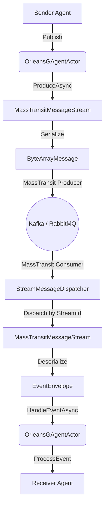

# MassTransit Stream Plugin 集成指南

## 1. 架构与原理

MassTransit Stream 插件为 Aevatar 框架提供了基于消息队列（如 Kafka, RabbitMQ）的事件流支持，替代了默认的内存或 Orleans Stream 实现。

### 核心组件

1.  **IMessageStreamProvider (抽象层)**
    *   定义了获取 `IMessageStream` 的标准接口。
    *   允许 Runtime（如 Orleans, ProtoActor）动态选择不同的流实现。

2.  **MassTransitMessageStream (实现层)**
    *   实现了 `IMessageStream` 接口。
    *   **发送 (Produce)**：将 `EventEnvelope` 序列化为 `byte[]`，包装在 `ByteArrayMessage` 中，通过 MassTransit 发送到消息队列。
    *   **接收 (Subscribe)**：并不直接监听队列，而是注册一个本地回调。

3.  **StreamMessageDispatcher (分发器)**
    *   这是 MassTransit 的 `IConsumer<ByteArrayMessage>`。
    *   它是一个**单例消费者**，监听指定 Topic/Queue 的所有消息。
    *   **职责**：收到消息后，根据 `StreamId` 查找内存中对应的 `MassTransitMessageStream` 实例，并将消息分发给该 Stream 的订阅者（即具体的 Agent Actor）。

### 数据流向图 (跨 Agent 通信)



---

## 2. 消息传播与自我保护机制

在 Aevatar 框架中，事件传播遵循层级路由规则（Up/Down/Both）。为了防止无限递归，框架默认开启了自我保护：

**如果事件的发布者 ID (PublisherId) 等于当前 Agent 的 ID，该事件将被自动忽略。**

这意味着：
*   **正确做法**：让 Agent A 发送消息给 Agent B（通过 `LinkParentChild` 建立关系后广播，或直接发送）。
*   **测试场景**：如果要测试单个 Agent 自己发给自己，需要显式在 Handler 上添加 `[EventHandler(AllowSelfHandling = true)]`。但在生产环境中，更推荐使用多 Agent 协作模式。

### 最佳实践示例

```csharp
// 1. 创建两个 Agent
var senderId = Guid.NewGuid();
var receiverId = Guid.NewGuid();
var sender = await actorManager.CreateAndRegisterAsync<MyAgent>(senderId);
var receiver = await actorManager.CreateAndRegisterAsync<MyAgent>(receiverId);

// 2. 建立层级关系 (Sender 是 Receiver 的父节点)
await actorManager.LinkParentChildAsync(senderId, receiverId);

// 3. Sender 向下广播事件
await sender.PublishEventAsync(new MyEvent(), EventDirection.Down);

// 4. 结果：Receiver 收到并处理事件，Sender 忽略自己发出的事件
```

---

## 3. Silo 集成指南

要在 Orleans Silo 中启用 MassTransit Stream，请按照以下步骤操作。

### 第一步：添加依赖

在 Silo 项目（如 `Aevatar.Silo`）中引用插件项目：

```xml
<ProjectReference Include="..\..\..\src\Aevatar.Agents.Plugins.MassTransit\Aevatar.Agents.Plugins.MassTransit.csproj" />
```

### 第二步：注册服务

在 `Program.cs` 或 `Startup.cs` 中注册插件：

```csharp
using Aevatar.Agents.Plugins.MassTransit.DependencyInjection;

// ...

host.ConfigureServices((context, services) =>
{
    // 1. 注册 MassTransit Stream 插件
    // 这会自动读取配置并注册 MassTransit, Rider (Kafka) 等
    services.AddMassTransitStreamPlugin(context.Configuration);

    // 2. 添加 Aevatar Agent System
    services.AddAevatarAgentSystem(builder =>
    {
        // 3. 使用 Orleans Runtime，并传入配置
        // Runtime 内部会根据配置决定使用哪个 Stream Provider
        builder.UseOrleansRuntime(context.Configuration);
    });
});
```

### 第三步：配置文件 (appsettings.json)

需要配置两部分：`MessageStream`（选择提供者）和 `MassTransit`（具体参数）。

```json
{
  "MessageStream": {
    "Provider": "MassTransit",  // 全局默认使用 MassTransit
    "Runtime": {
      "Orleans": "MassTransit"  // 显式指定 Orleans Runtime 使用 MassTransit
    }
  },
  "MassTransit": {
    "Stream": {
      "TopicPrefix": "agent-events",
      "TransportType": "Kafka",     // 可选: InMemory, Kafka, RabbitMQ
      "RuntimeName": "OrleansSilo", // 用于区分不同节点的消费者组或队列名
      "Kafka": {
        "BootstrapServers": "localhost:9092",
        "ConsumerGroupId": "aevatar-agents-group"
      },
      "RabbitMQ": {
        "Host": "localhost",
        "Username": "guest",
        "Password": "guest"
      }
    }
  }
}
```

### 关键配置项说明

*   **`MessageStream:Provider`**: 控制默认行为。设为 `Default` 则使用原生的 Orleans Streams，设为 `MassTransit` 则启用插件。
*   **`TransportType`**: 
    *   `InMemory`: 仅用于单机测试，无法跨进程通信。
    *   `Kafka`: 生产环境推荐，支持高吞吐。
    *   `RabbitMQ`: 另一种可靠的消息队列选择。
*   **`RuntimeName`**: 在 Kafka 模式下影响 ConsumerGroup 命名，在 RabbitMQ 下影响 Queue 命名，确保不同服务的名称唯一性。

---

## 4. 常见问题排查

1.  **收不到消息？**
    *   检查 Kafka/RabbitMQ 服务是否正常。
    *   检查 `TopicPrefix` 是否一致。
    *   检查是否触发了自我保护机制（自己发给自己且未开启 `AllowSelfHandling`）。

2.  **无法解析消息类型？**
    *   MassTransit 插件传输的是 Protobuf 的 `Any` 类型。
    *   确保发送方和接收方都引用了相同的 Protobuf 定义程序集。
    *   日志中如果有 `TypeUrl` 正确但 Handler 未触发的情况，通常是 `GAgentBase` 的事件分发逻辑问题，而非传输问题。

3.  **Kafka 连接报错？**
    *   检查 `BootstrapServers` 地址。
    *   开发环境下，插件已默认设置 `SecurityProtocol = Plaintext` 以避免 SASL 错误。生产环境可能需要通过 `MassTransitStreamOptions` 扩展更多安全配置。
