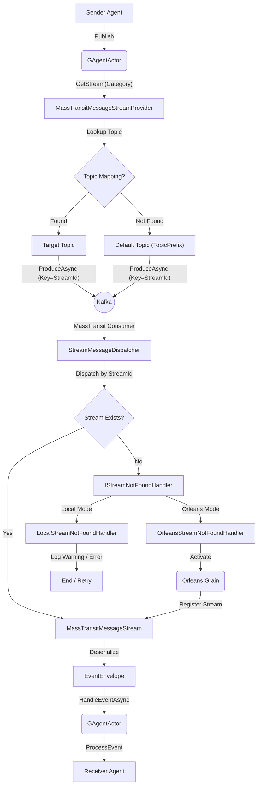

# MassTransit Stream Plugin 集成指南

## 1. 架构与原理

MassTransit Stream 插件为 Aevatar 框架提供了基于消息队列（如 Kafka, RabbitMQ）的事件流支持，采用**插件化架构**设计，使核心逻辑与底层传输解耦。

### 核心组件架构

该架构采用“依赖倒置”原则，插件不直接依赖运行时，而是通过抽象接口进行交互。

1.  **公共层 (Plugins.MassTransit)**
    *   **`MassTransitMessageStreamProvider`**: 负责创建和管理流实例。
    *   **`StreamMessageDispatcher`**: MassTransit 的消费者（Consumer）。负责监听消息队列，收到消息后，根据 `StreamId` 将消息分发给内存中的 `IMessageStream`。
    *   **关键机制**: 如果内存中找不到对应的 Stream（意味着 Actor 未激活），Dispatcher 会调用 `IStreamNotFoundHandler` 尝试唤醒 Actor。

2.  **抽象层 (Abstractions)**
    *   **`IStreamNotFoundHandler`**: 定义了“当消息到达但接收者不在家时该怎么办”的策略接口。
    *   **`[StreamTopic]` Attribute**: 用于 Agent 类上的声明式 Topic 路由配置。

3.  **运行时适配层 (Runtime Adaptation)**
    *   **Orleans Runtime**: 实现了 `OrleansStreamNotFoundHandler`。利用 Virtual Actor 特性，通过 `GrainFactory.GetGrain(...).ActivateAsync()` 自动唤醒 Grain。
    *   **Local Runtime**: 实现了 `LocalStreamNotFoundHandler`。由于 Local Runtime 是内存模型，不支持自动唤醒（除非手动创建），因此该 Handler 主要负责记录警告日志或抛出异常以触发重试。

### 数据流向图 (跨 Agent 通信)



---

## 2. 动态 Topic 路由与配置

MassTransit 插件支持灵活的 **Category -> Topic** 映射机制，允许将不同类型的 Agent 路由到不同的 Kafka Topic。

### 优先级规则

路由配置遵循以下优先级（由高到低）：

1.  **`appsettings.json` 配置**: 运维人员可以在部署时覆盖一切代码设定。
2.  **`[StreamTopic]` 注解**: 开发者在代码中声明的默认 Topic。
3.  **类名回退**: 如果无注解，使用 Agent 的类名作为 Category。
4.  **默认 Topic**: 如果 Category 没有在映射表中找到对应 Topic，则使用全局的 `TopicPrefix` (默认 `agent-events`)。

### 方式一：使用注解（推荐）

在 Agent 类上直接声明目标 Topic：

```csharp
[StreamTopic("finance-billing")]
public class BillingAgent : GAgentBase<BillingState>
{
    // ...
}
```

在启动时，插件会自动扫描并注册该 Topic。

### 方式二：使用配置文件

在 `appsettings.json` 中配置映射：

```csharp
"MassTransit": {
  "Stream": {
    "TopicPrefix": "agent-events",
    "TopicMapping": {
      "BillingAgent": "finance-billing-v2", // 覆盖代码中的 v1
      "UserAgent": "user-events"
    }
  }
}
```

---

## 3. Runtime 集成指南

### Producer-only 客户端模式（仅发送/基准压测）
当客户端只需要“发送、不消费”时，请使用 Producer-only 注册，避免与 Silo 消费者竞争 Kafka 消费：

```csharp
// 客户端（仅发送，不订阅）
services.AddMassTransitStreamClient(configuration);
```

> 需要消费的场景（Silo / 本地双工）继续使用 `AddMassTransitStreamPlugin`。

Producer-only 路径同样会扫描 `[StreamTopic]`，以便 Category→Topic 映射在客户端生效；如果没有注解/配置，则回退到 `TopicPrefix`。

客户端与 Silo **必须使用一致的 Stream Provider**，否则会出现“客户端发 MassTransit，Silo 只收 Orleans Stream”的错配，导致收不到消息：

```json
"MessageStream": { "Provider": "MassTransit" }   // 或 "Orleans"
```

### 通用步骤 (适用于所有 Runtime)

1.  **引用插件**:
    ```xml
    <ProjectReference Include="..\..\..\plugins\Aevatar.Agents.Plugins.MassTransit\Aevatar.Agents.Plugins.MassTransit.csproj" />
    ```

2.  **代码集成 - 多种程序集发现方式**:

    #### 方式一：全自动发现（推荐）
    
    无需指定任何程序集，插件会自动扫描所有已加载的程序集，找到包含 `IGAgent` 实现的程序集：
    
    ```csharp
    // 自动发现所有 Agent 程序集
    services.AddMassTransitStreamPlugin(configuration);
    ```
    
    #### 方式二：基于命名约定发现
    
    当 Agent 程序集遵循命名约定时（如 `*.Agents.*`），可以使用模式匹配：
    
    ```csharp
    // 按程序集名称模式匹配（支持 * 通配符）
    services.AddMassTransitStreamPluginWithPatterns(
        configuration,
        "*.Agents.*",           // 匹配所有包含 .Agents. 的程序集
        "MyCompany.Agents.*",   // 匹配 MyCompany.Agents 命名空间下的程序集
        "Demo.Agents"           // 精确匹配
    );
    ```
    
    #### 方式三：显式指定程序集
    
    当需要精确控制扫描范围时，手动指定程序集列表：
    
    ```csharp
    // 显式指定多个程序集
    services.AddMassTransitStreamPlugin(
        configuration, 
        typeof(MyAgent).Assembly,
        typeof(AnotherAgent).Assembly,
        typeof(ThirdAgent).Assembly
    );
    
    // 或使用数组
    var agentAssemblies = new[] { 
        typeof(MyAgent).Assembly, 
        typeof(AnotherAgent).Assembly 
    };
    services.AddMassTransitStreamPlugin(configuration, agentAssemblies);
    ```

    #### 辅助方法：获取发现的程序集列表
    
    如果需要在其他地方使用发现的程序集（如 Orleans Silo 配置），可以直接调用发现方法：
    
    ```csharp
    // 自动发现所有包含 IGAgent 的程序集
    var assemblies = ServiceCollectionExtensions.DiscoverAgentAssemblies();
    
    // 基于模式发现程序集
    var patternAssemblies = ServiceCollectionExtensions.DiscoverAgentAssembliesByPattern("*.Agents.*");
    ```

### Orleans Runtime 集成

```csharp
host.ConfigureServices((context, services) =>
{
    // 推荐：自动发现所有 Agent 程序集（Silo 侧：Producer + Consumer）
    services.AddMassTransitStreamPlugin(context.Configuration);

    services.AddAevatarAgentSystem(builder =>
    {
        builder.UseOrleansRuntime(context.Configuration);
    });
});
```

> Orleans 专有说明：`StreamMessageDispatcher` 会将消息委派给 `IMassTransitEventHandler`（Orleans 侧实现为 `OrleansMassTransitEventHandler`），通过 Orleans RPC 在 Grain turn 中执行，避免 “Grain context missing”。

### 冷启动预热建议
- 初次启动 MassTransit/Kafka 时，Consumer & Producer 都需要连接、拉取元数据，可能导致首轮调用偏慢。
- 可以在启动后做一次“创建 Agent + 状态查询”或发送一条空转消息作为预热。
- 压测/长连场景：保持 Bus 常驻可避免冷启动抖动。

### Local Runtime 集成

```csharp
// 推荐：自动发现
services.AddMassTransitStreamPlugin(configuration);
services.AddAevatarLocalRuntime();

// 或者：基于模式发现
services.AddMassTransitStreamPluginWithPatterns(configuration, "*.Agents.*");
services.AddAevatarLocalRuntime();
```

---

## 4. 性能优化特性

插件内置了多项针对 Kafka 的性能优化：

1.  **Partition Ordering (Key-based)**:
    Producer 发送消息时，使用 `StreamId` 作为 Kafka Message Key。这确保了同一个 Agent 的所有消息都会落入同一个 Partition，从而利用 Kafka 原生的分区顺序性保证消息处理顺序，无需在 Consumer 端进行昂贵的重排序。

2.  **Batch Processing**:
    Consumer 配置了 `CheckpointMessageCount = 100` 和 `CheckpointInterval = 5s`，启用批量提交 Offset，大幅减少 Kafka 交互开销。

3.  **Concurrency**:
    默认启用 `UseConcurrencyLimit(50)`，允许单个 Consumer 实例并发处理不同 Partition 的消息，最大化吞吐量。

---

## 5. 验证与测试工具

### 性能基准测试 (Orleans vs MassTransit)

位于 `apps/Aevatar.App/benchmarks`。

**运行方式**：
```bash
cd apps/Aevatar.App/benchmarks
./run-benchmark-comparison.sh
```

**最新 Benchmark 结果 (Kafka Mode)**：
*   **MassTransit**: ~12,500 msg/s (得益于批处理和并发优化)
*   **Orleans Stream**: ~13.5 msg/s (受限于逐条确认机制)

---

## 6. 冷启动优化 (Warmup)

### 问题
MassTransit + Kafka 首次发送消息时延迟较高（100+ms），因为：
1. Kafka Producer 首次发送需要获取 Broker metadata
2. Orleans Client 首次调用需要建立连接
3. Grain 首次激活需要从存储加载状态

### 解决方案：预热 API

**Kafka Producer 预热**：
```csharp
// 在 MassTransit 服务启动后调用
var streamProvider = serviceProvider.GetService<MassTransitMessageStreamProvider>();
if (streamProvider != null)
{
    await streamProvider.WarmupAsync();  // 发送空消息建立 Kafka 连接
}
```

**Orleans Client 预热**：
```csharp
// 创建一个临时 Agent 触发 RPC 连接
var warmupId = Guid.NewGuid();
var warmupAgent = await manager.CreateAndRegisterAsync<SimpleAgent>(warmupId);
await warmupAgent.GetDescriptionAsync();  // 触发 RPC
```

### 预热效果

| 指标 | 无预热冷启动 | 有预热冷启动 | 热运行 |
|------|-------------|-------------|--------|
| Agent Creation | ~145ms | **14ms** | 7ms |
| Message Average | ~100ms | **10ms** | 10ms |
| State Query | ~2340ms | **69ms** | 24ms |

> **注意**: 预热消息使用 `StreamId = Guid.Empty`，Consumer 会自动忽略。

---

## 7. 常见问题排查

1.  **消息发送到了错误的 Topic？**
    *   检查 `appsettings.json` 中的 `TopicMapping` 是否覆盖了预期配置。
    *   检查 Agent 类上的 `[StreamTopic]` 注解是否正确。
    *   如果没有配置，消息会默认发送到 `TopicPrefix` 指定的 Topic。

2.  **收不到消息？**
    *   **Orleans**: 检查 Silo 日志中是否包含 `No stream found`，如果数量在减少，说明 Auto-Activation 正在工作。
    *   **Local**: Local 模式不支持自动唤醒，必须先创建 Agent。

3.  **Kafka Consumer Group 冲突？**
    *   所有 Topic 默认使用配置中的同一个 Consumer Group ID。MassTransit 会自动管理订阅。
