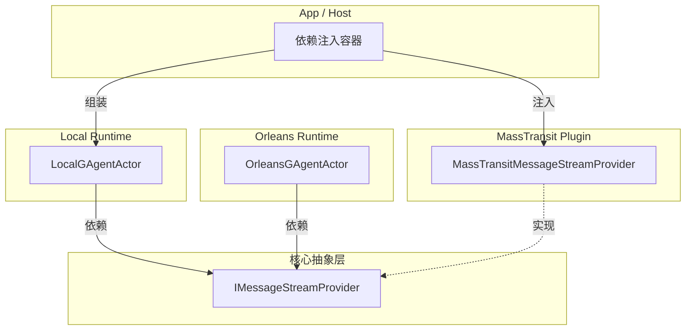

# MassTransit Integration Plan - Stream Plugin 方案

## 📋 方案概述

**目标**：将 MassTransit 集成作为**可插拔的消息流插件**（Stream Plugin），而非独立的 Runtime。通过引入标准化的 `IMessageStreamProvider` 接口，实现 Runtime 与具体 Stream 实现的解耦。

**原则**：
- ✅ **插件化架构**：MassTransit 作为可选插件
- ✅ **解耦**：Runtime 不依赖具体 Stream 实现
- ✅ **不影响现有代码**：Phase 1 只增不改
- ✅ **配置驱动**：通过配置灵活切换

## 🏗️ 架构设计

### 1. 核心抽象层 (Aevatar.Agents.Abstractions)

引入新的接口，用于获取 Stream 实例：

```csharp
namespace Aevatar.Agents.Abstractions;

/// <summary>
/// 消息流提供者接口
/// 负责为 Agent 创建或获取 IMessageStream 实例
/// </summary>
public interface IMessageStreamProvider
{
    /// <summary>
    /// 获取指定 Agent 的消息流
    /// </summary>
    IMessageStream GetStream(Guid agentId);
}
```

### 2. 插件项目结构 (Aevatar.Agents.Plugins.MassTransit)

```
src/
  Aevatar.Agents.Plugins.MassTransit/     # 重命名为 Plugins
    ├── MassTransitMessageStream.cs
    ├── MassTransitMessageStreamSubscription.cs
    ├── MassTransitMessageStreamProvider.cs  # 实现 IMessageStreamProvider
    ├── MassTransitStreamOptions.cs
    ├── DependencyInjection/
    │   └── ServiceCollectionExtensions.cs
    └── Serialization/
        └── ProtobufMessageSerializer.cs
```

### 3. 集成架构图



### 核心类设计

#### 1. MassTransitMessageStream

```csharp
namespace Aevatar.Agents.Plugins.MassTransit;

/// <summary>
/// MassTransit 实现的 Message Stream
/// </summary>
public class MassTransitMessageStream : IMessageStream
{
    // ... 实现同前
}
```

#### 2. MassTransitMessageStreamProvider (插件入口)

```csharp
namespace Aevatar.Agents.Plugins.MassTransit;

/// <summary>
/// MassTransit 插件的 Stream Provider 实现
/// </summary>
public class MassTransitMessageStreamProvider : IMessageStreamProvider
{
    private readonly IBus _bus;
    private readonly string _topicPrefix;
    
    public IMessageStream GetStream(Guid agentId)
    {
        // 格式：{TopicPrefix}-{AgentId}
        var topic = $"{_topicPrefix}-{agentId}";
        return new MassTransitMessageStream(agentId, _bus, topic);
    }
}
```

## ⚙️ 配置与使用

### 1. 添加 NuGet 依赖

```xml
<PackageReference Include="Aevatar.Agents.Plugins.MassTransit" Version="1.0.0" />
```

### 2. 注册插件 (Program.cs)

```csharp
// 1. 注册 Local Runtime (Actor 逻辑)
services.AddAevatarLocalRuntime(); 

// 2. 注册 MassTransit Plugin (Stream 逻辑)
services.AddMassTransitStreamPlugin(configuration);

// 3. 【关键】将插件注册为默认 Provider (可选，取决于配置)
// 如果在 appsettings.json 中配置了使用 MassTransit，则 DI 会自动注入
```

### 3. 依赖注入扩展

```csharp
public static class ServiceCollectionExtensions
{
    public static IServiceCollection AddMassTransitStreamPlugin(
        this IServiceCollection services,
        IConfiguration configuration)
    {
        // 配置 MassTransit...
        
        // 注册 Provider 实现（但不一定是默认的 IMessageStreamProvider）
        services.AddSingleton<MassTransitMessageStreamProvider>();
        
        return services;
    }
}
```

## 🚀 实施步骤

### Phase 1: 基础实现（插件开发）

1. ✅ 在 Abstractions 中添加 `IMessageStreamProvider` 接口
2. ✅ 创建项目 `Aevatar.Agents.Plugins.MassTransit`
3. ✅ 实现 `MassTransitMessageStream`
4. ✅ 实现 `MassTransitMessageStreamProvider`
5. ✅ 实现配置和 DI 扩展

**验收**：插件可独立编译、测试，不依赖 Runtime。

### Phase 2: Runtime 适配（解耦）

1. ✅ 修改 `LocalGAgentActor` 构造函数，依赖 `IMessageStreamProvider` 而非具体 Registry
2. ✅ 修改 `OrleansGAgentActor` 构造函数，依赖 `IMessageStreamProvider`
3. ✅ 为现有 Runtime 实现默认 Provider (`LocalStreamProvider`, `OrleansStreamProvider`) 以保持兼容

**验收**：Runtime 不再硬编码 Stream 实现，而是通过 DI 获取。

### Phase 3: 集成与切换

1. ✅ 在应用层通过配置选择使用哪个 Provider
2. ✅ 验证 MassTransit 插件在 Local/Orleans Runtime 中的表现

## ✅ 总结

通过将 MassTransit 实现定位为 **Plugin** 并引入 `IMessageStreamProvider`，我们将架构从“垂直耦合”转变为“组合模式”。Local/Orleans 关注 Actor 生命周期，插件关注消息传输，两者在应用层自由组合。

### 4. MassTransitStreamOptions

```csharp
namespace Aevatar.Agents.Plugins.MassTransit;

/// <summary>
/// MassTransit Stream 配置选项
/// </summary>
public class MassTransitStreamOptions
{
    /// <summary>
    /// Topic 前缀（用于生成 Agent 的 Topic）
    /// </summary>
    public string TopicPrefix { get; set; } = "agent-events";
    
    /// <summary>
    /// 传输方式：InMemory, Kafka, RabbitMQ
    /// </summary>
    public MassTransitTransportType TransportType { get; set; } = MassTransitTransportType.InMemory;
    
    /// <summary>
    /// Kafka 配置（当 TransportType = Kafka 时使用）
    /// </summary>
    public KafkaOptions? Kafka { get; set; }
    
    /// <summary>
    /// RabbitMQ 配置（当 TransportType = RabbitMQ 时使用）
    /// </summary>
    public RabbitMQOptions? RabbitMQ { get; set; }
}
```

## ⚙️ 配置设计

### appsettings.json 配置示例

```json
{
  "MassTransit": {
    "Stream": {
      "TopicPrefix": "agent-events",
      "TransportType": "Kafka",
      "Kafka": {
        "BootstrapServers": "localhost:9092",
        "ConsumerGroupId": "aevatar-agents"
      }
    }
  },
  
  "MessageStream": {
    "Provider": "MassTransit",  // 明确指定使用 MassTransit 插件
    "Runtime": {
      "Local": "Default",      // Local 运行时使用 Default (LocalMessageStream)
      "ProtoActor": "MassTransit",  // ProtoActor 运行时使用 MassTransit
      "Orleans": "Default"     // Orleans 运行时使用 Default (OrleansMessageStream)
    }
  }
}
```

## 🔌 依赖注入设计

### ServiceCollectionExtensions

```csharp
namespace Aevatar.Agents.Plugins.MassTransit.DependencyInjection;

public static class ServiceCollectionExtensions
{
    /// <summary>
    /// 添加 MassTransit Message Stream 插件支持
    /// </summary>
    public static IServiceCollection AddMassTransitStreamPlugin(
        this IServiceCollection services,
        IConfiguration configuration)
    {
        // 1. 配置选项
        services.Configure<MassTransitStreamOptions>(
            configuration.GetSection("MassTransit:Stream"));
            
        // ... MassTransit 配置逻辑 (同前) ...
        
        // 4. 注册 Provider
        services.AddSingleton<MassTransitMessageStreamProvider>(sp =>
        {
            var bus = sp.GetRequiredService<IBus>();
            var streamOptions = sp.GetRequiredService<IOptions<MassTransitStreamOptions>>().Value;
            return new MassTransitMessageStreamProvider(bus, streamOptions.TopicPrefix);
        });
        
        return services;
    }
}
```

## 🔄 集成到现有 Runtime (Phase 2)

### 解耦 Local Runtime

```csharp
// LocalGAgentActor.cs - 依赖抽象接口
public class LocalGAgentActor : GAgentActorBase
{
    private readonly IMessageStream _myStream;
    
    // 构造函数注入 IMessageStreamProvider
    public LocalGAgentActor(
        IGAgent agent,
        IMessageStreamProvider streamProvider) // ✅ 依赖接口
    {
        _myStream = streamProvider.GetStream(agent.Id);
    }
}
```

### 适配现有实现

为了保持兼容，我们需要将现有的 Registry 适配为 Provider：

```csharp
// LocalStreamProviderAdapter.cs
public class LocalStreamProviderAdapter : IMessageStreamProvider
{
    private readonly LocalMessageStreamRegistry _registry;
    public LocalStreamProviderAdapter(LocalMessageStreamRegistry registry) => _registry = registry;
    
    public IMessageStream GetStream(Guid agentId) => _registry.GetOrCreateStream(agentId);
}
```

## 📦 NuGet 依赖

```xml
<Project Sdk="Microsoft.NET.Sdk">
  <ItemGroup>
    <PackageReference Include="MassTransit" Version="8.2.0" />
    <PackageReference Include="MassTransit.Kafka" Version="8.2.0" />
    <PackageReference Include="MassTransit.RabbitMQ" Version="8.2.0" />
    <!-- 引用 Abstractions -->
    <ProjectReference Include="..\..\Aevatar.Agents.Abstractions\Aevatar.Agents.Abstractions.csproj" />
  </ItemGroup>
</Project>
```

## 🚀 实施步骤

### Phase 1: 插件开发（不影响现有代码）⭐

1. ✅ 在 Abstractions 中定义 `IMessageStreamProvider`
2. ✅ 创建项目 `Aevatar.Agents.Plugins.MassTransit`
3. ✅ 实现 `MassTransitMessageStream`
4. ✅ 实现 `MassTransitMessageStreamProvider`
5. ✅ 实现 DI 扩展 `AddMassTransitStreamPlugin`
6. ✅ 添加单元测试

**验收**：插件库开发完成，可独立测试的消息流功能。

### Phase 2: 独立使用测试（可选）

1. ✅ 创建示例项目
2. ✅ 验证 In-Memory/Kafka 传输
3. ✅ 性能测试

### Phase 3: Runtime 解耦与集成（可选）

1. ✅ 改造 `LocalGAgentActor` 使用 `IMessageStreamProvider`
2. ✅ 实现 `LocalStreamProviderAdapter` 并注册
3. ✅ 在应用层通过配置切换 Provider

## 🔍 关键实现细节

### Protobuf 序列化处理

推荐使用 **Byte Array 包装** 方案，简单且兼容性好：

```csharp
// MassTransitMessageStream.cs
public async Task ProduceAsync<T>(T message, CancellationToken ct = default) where T : IMessage
{
    if (message is EventEnvelope envelope)
    {
        using var stream = new MemoryStream();
        envelope.WriteTo(stream);
        // 发送 byte[]
        await _bus.Publish(new ByteArrayMessage { Data = stream.ToArray() }, ct);
    }
}
```

## 📊 后续计划

- Phase 4: 逐步将 ProtoActor/Orleans Runtime 也迁移到 `IMessageStreamProvider` 模式
- Phase 5: 最终实现完全的插件化架构，Runtime 与 Stream 自由组合

