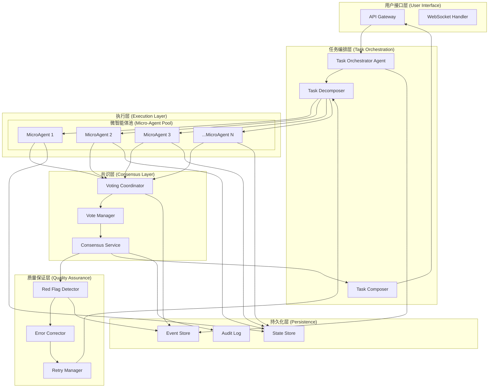

# MDAP Integration with Aevatar Agent Framework 🚀

## 概述 (Overview)

本文档描述了如何将 [MDAP (Massively Decomposed Agentic Processes)](https://arxiv.org/html/2511.09030v1) 框架集成到 Aevatar Agent Framework 中，实现百万级步骤的零错误任务执行能力。

MDAP 是由 Cognizant AI Lab 提出的革命性方法，通过 MAKER 系统成功解决了超过 100 万步的任务且零错误。这一成就通过三个核心组件实现：
- **极端分解** (Maximal Decomposition)
- **错误纠正** (Error Correction) 
- **红旗标记** (Red-flagging)

## 📚 背景 (Background)

### MDAP 论文关键洞察

1. **规模化的正交方向**：不是追求更"智能"的基础 LLM，而是通过极端分解和错误纠正实现规模化
2. **微角色而非人类角色**：避免拟人化，将 agent 分配到极小的"微角色"
3. **投票机制**：通过 first-to-ahead-by-k 投票实现高可靠性
4. **红旗检测**：识别不可靠信号，减少相关错误

### 为什么与 Aevatar 结合？

Aevatar Agent Framework 的设计理念与 MDAP 高度契合：
- **事件驱动架构**：天然支持大规模并行微任务
- **Actor 模型**：每个 GAgent 可以作为独立的微智能体
- **分布式支持**：Orleans/ProtoActor 运行时可扩展到百万级 agent
- **流式通信**：支持高效的投票和共识机制

## 🏗️ 架构设计 (Architecture Design)

### 基类选择原则

在 MDAP 实现中，不同组件根据其功能需求选择合适的基类：

| 组件类型 | 基类 | 原因 |
|---------|------|------|
| **MicroTaskAgent** | `AIGAgentBase<TState, TEvent>` | 需要 LLM 推理能力执行原子任务 |
| **MDAPOrchestratorAgent** | `AIGAgentBase<TState>` | 需要 AI 能力分解任务和组合结果 |
| **RedFlagDetectorAgent** | `AIGAgentBase<TState>` | 需要 AI 分析响应质量 |
| **VotingCoordinatorAgent** | `GAgentBase<TState>` | 仅需事件处理，不需 AI 能力 |
| **TaskDecomposerTool** | `AevatarToolBase` | 工具基类，内部调用 LLM 服务 |

关键差异：
- `AIGAgentBase`: 内置 LLM 集成、工具管理、处理策略、ChatAsync 方法
- `GAgentBase`: 基础事件驱动能力，无 AI 功能
- `AevatarToolBase`: 工具实现基类，可按需调用 LLM

### 系统架构图



### 核心组件说明

| 组件 | 职责 | 实现类 |
|-----|------|--------|
| Task Orchestrator | 主任务协调 | `MDAPOrchestratorAgent` |
| Task Decomposer | 任务分解为原子任务 | `TaskDecomposerTool` |
| MicroAgent | 执行原子任务 | `MicroTaskAgent` |
| Voting Coordinator | 投票协调 | `VotingCoordinatorAgent` |
| Red Flag Detector | 检测不可靠信号 | `RedFlagDetectorAgent` |
| Error Corrector | 错误纠正 | `ErrorCorrectorAgent` |

## 💻 实现方案 (Implementation Plan)

### Phase 1: 基础设施准备 (Infrastructure Setup)

#### 1.1 Protobuf 消息定义

```protobuf
// src/Aevatar.Agents.AI.Abstractions/mdap_messages.proto
syntax = "proto3";
package aevatar.mdap;

import "google/protobuf/timestamp.proto";
import "google/protobuf/any.proto";

// 任务分解事件
message TaskDecompositionEvent {
    string task_id = 1;
    string parent_task_id = 2;
    int32 decomposition_level = 3;
    repeated AtomicTask subtasks = 4;
    google.protobuf.Timestamp timestamp = 5;
}

// 原子任务
message AtomicTask {
    string id = 1;
    string content = 2;
    int32 expected_steps = 3;
    map<string, string> parameters = 4;
}

// 投票事件
message VoteEvent {
    string task_id = 1;
    string agent_id = 2;
    string result_hash = 3;
    google.protobuf.Any result = 4;
    double confidence = 5;
    google.protobuf.Timestamp timestamp = 6;
}

// 共识事件
message ConsensusEvent {
    string task_id = 1;
    int32 total_votes = 2;
    int32 winning_votes = 3;
    google.protobuf.Any consensus_result = 4;
    int32 k_parameter = 5;
    google.protobuf.Timestamp timestamp = 6;
}

// 红旗事件
message RedFlagEvent {
    string task_id = 1;
    string agent_id = 2;
    repeated string flags = 3;
    string reason = 4;
    RecommendedAction action = 5;
    google.protobuf.Timestamp timestamp = 6;
}

enum RecommendedAction {
    RETRY = 0;
    REDECOMPOSE = 1;
    ESCALATE = 2;
    ABORT = 3;
}
```

#### 1.2 配置结构

```csharp
// src/Aevatar.Agents.AI.Core/MDAP/MDAPConfiguration.cs
namespace Aevatar.Agents.AI.Core.MDAP;

public class MDAPConfiguration
{
    // 分解参数
    public int MaxDecompositionDepth { get; set; } = 10;
    public int MinAtomicTaskSize { get; set; } = 1;
    public int MaxAtomicTaskSize { get; set; } = 5;
    
    // 投票参数
    public int VotingK { get; set; } = 3;
    public int MaxVotingRounds { get; set; } = 20;
    public TimeSpan VotingTimeout { get; set; } = TimeSpan.FromSeconds(30);
    
    // 并发参数
    public int MaxConcurrentMicroAgents { get; set; } = 100;
    public int MicroAgentPoolSize { get; set; } = 500;
    
    // 红旗参数
    public double RedFlagConfidenceThreshold { get; set; } = 0.7;
    public int MaxRetryAttempts { get; set; } = 3;
    
    // LLM 参数
    public string DefaultModel { get; set; } = "gpt-4o-mini";
    public double Temperature { get; set; } = 0.1;
    public int MaxTokens { get; set; } = 2048;
}
```

### Phase 2: 核心组件实现 (Core Components)

#### 2.0 状态定义

```protobuf
// src/Aevatar.Agents.AI.Abstractions/mdap_states.proto
syntax = "proto3";
package aevatar.mdap;

// 微任务智能体状态
message MicroTaskState {
    string agent_id = 1;
    int32 tasks_processed = 2;
    int32 errors_encountered = 3;
    double average_confidence = 4;
    google.protobuf.Timestamp last_activity = 5;
}

// 投票协调器状态
message VotingState {
    int32 active_sessions = 1;
    int32 total_consensus_reached = 2;
    int32 total_votes_collected = 3;
    double average_rounds_to_consensus = 4;
}

// 编排器状态
message OrchestratorState {
    string current_task_id = 1;
    int32 total_subtasks = 2;
    int32 completed_subtasks = 3;
    repeated string active_agents = 4;
    google.protobuf.Timestamp start_time = 5;
}

// 红旗检测器状态
message RedFlagState {
    int32 flags_raised = 1;
    int32 retries_triggered = 2;
    map<string, int32> flag_counts = 3;
}
```

#### 2.1 微智能体实现

```csharp
// src/Aevatar.Agents.AI.Core/MDAP/MicroTaskAgent.cs
using Aevatar.Agents.Core;
using Aevatar.Agents.AI.Core;
using Aevatar.Agents.AI.Abstractions;

namespace Aevatar.Agents.AI.Core.MDAP;

public class MicroTaskAgent : AIGAgentBase<MicroTaskState, AtomicTask>
{
    private readonly MDAPConfiguration _config;
    
    public MicroTaskAgent() : base()
    {
        // AIGAgentBase 已经包含了 LLMProvider 和其他 AI 功能
    }
    
    protected override async Task OnActivateAsync(CancellationToken ct = default)
    {
        await base.OnActivateAsync(ct);
        
        // 配置专门的系统提示词
        SystemPrompt = "You are a highly specialized micro-agent. Execute ONLY the specific atomic task given. Be precise, deterministic, and output ONLY the direct answer.";
        
        // 配置 AI 设置
        Configuration.Temperature = 0.1; // 低温度确保确定性
        Configuration.MaxTokens = 500; // 原子任务不需要太多 token
    }
    
    [AevatarAIEventHandler(
        Description = "Handle atomic task assignment",
        ProcessingMode = AevatarAIProcessingMode.Direct
    )]
    public async Task<VoteEvent> HandleAtomicTaskAssigned(AtomicTask task)
    {
        try
        {
            // 构建专注的提示词
            var prompt = BuildAtomicPrompt(task);
            
            // 使用内置的 ChatAsync 方法执行推理
            var response = await ChatAsync(prompt);
            
            // 创建投票事件
            var voteEvent = new VoteEvent
            {
                TaskId = task.Id,
                AgentId = Id.ToString(),
                ResultHash = ComputeHash(response),
                Result = Google.Protobuf.WellKnownTypes.Any.Pack(
                    new StringValue { Value = response }),
                Confidence = EstimateConfidence(),
                Timestamp = Timestamp.FromDateTime(DateTime.UtcNow)
            };
            
            // 发布结果供投票（向上传播到投票协调器）
            await PublishAsync(voteEvent, EventDirection.Up);
            
            return voteEvent;
        }
        catch (Exception ex)
        {
            Logger?.LogError(ex, "Failed to execute atomic task {TaskId}", task.Id);
            
            // 发布错误作为红旗
            var redFlag = new RedFlagEvent
            {
                TaskId = task.Id,
                AgentId = Id.ToString(),
                Flags = { "EXECUTION_ERROR" },
                Reason = ex.Message,
                Action = RecommendedAction.Retry
            };
            
            await PublishAsync(redFlag, EventDirection.Up);
            throw;
        }
    }
    
    private string BuildAtomicPrompt(AtomicTask task)
    {
        var prompt = $"Task: {task.Content}";
        
        if (task.Parameters?.Any() == true)
        {
            prompt += "\n\nParameters:";
            foreach (var param in task.Parameters)
            {
                prompt += $"\n- {param.Key}: {param.Value}";
            }
        }
        
        prompt += "\n\nProvide ONLY the direct answer, no explanation.";
        return prompt;
    }
    
    private double EstimateConfidence()
    {
        // 基于 AI 处理的内部状态估计置信度
        if (LastProcessingResult?.StopReason == AevatarStopReason.Complete)
            return 0.9;
        if (LastProcessingResult?.StopReason == AevatarStopReason.MaxTokens)
            return 0.3;
        return 0.5;
    }
    
    private string ComputeHash(string content)
    {
        using var sha256 = System.Security.Cryptography.SHA256.Create();
        var bytes = System.Text.Encoding.UTF8.GetBytes(content);
        var hash = sha256.ComputeHash(bytes);
        return Convert.ToBase64String(hash);
    }
    
    public override Task<string> GetDescriptionAsync()
    {
        return Task.FromResult($"MicroTaskAgent: Executing atomic tasks with high precision");
    }
}
```

#### 2.2 投票协调器实现

```csharp
// src/Aevatar.Agents.AI.Core/MDAP/VotingCoordinatorAgent.cs
namespace Aevatar.Agents.AI.Core.MDAP;

// 投票协调器不需要 AI 能力，使用基础 GAgentBase 即可
public class VotingCoordinatorAgent : GAgentBase<VotingState>
{
    private readonly MDAPConfiguration _config;
    private readonly Dictionary<string, VotingSession> _sessions = new();
    
    [EventHandler]
    public async Task HandleVoteEvent(VoteEvent vote)
    {
        if (!_sessions.ContainsKey(vote.TaskId))
        {
            _sessions[vote.TaskId] = new VotingSession
            {
                TaskId = vote.TaskId,
                StartTime = DateTime.UtcNow,
                Votes = new Dictionary<string, List<VoteEvent>>()
            };
        }
        
        var session = _sessions[vote.TaskId];
        
        // 按结果哈希分组投票
        if (!session.Votes.ContainsKey(vote.ResultHash))
            session.Votes[vote.ResultHash] = new List<VoteEvent>();
        
        session.Votes[vote.ResultHash].Add(vote);
        
        // 检查 first-to-ahead-by-k
        var winner = CheckFirstToAheadByK(session);
        if (winner != null)
        {
            await PublishAsync(new ConsensusEvent
            {
                TaskId = vote.TaskId,
                TotalVotes = session.TotalVotes,
                WinningVotes = winner.Count,
                ConsensusResult = winner.First().Result,
                KParameter = _config.VotingK,
                Timestamp = Timestamp.FromDateTime(DateTime.UtcNow)
            }, EventDirection.Up);
            
            // 清理会话
            _sessions.Remove(vote.TaskId);
        }
        else if (DateTime.UtcNow - session.StartTime > _config.VotingTimeout)
        {
            // 超时处理
            await HandleVotingTimeout(session);
        }
    }
    
    private List<VoteEvent>? CheckFirstToAheadByK(VotingSession session)
    {
        var sortedGroups = session.Votes
            .OrderByDescending(g => g.Value.Count)
            .ToList();
        
        if (sortedGroups.Count == 0) return null;
        
        var leader = sortedGroups[0];
        var second = sortedGroups.Count > 1 ? sortedGroups[1] : null;
        
        // First-to-ahead-by-k 逻辑
        if (second == null || leader.Value.Count - second.Value.Count >= _config.VotingK)
        {
            return leader.Value;
        }
        
        return null;
    }
}
```

#### 2.3 MDAP 编排器实现

```csharp
// src/Aevatar.Agents.AI.Core/MDAP/MDAPOrchestratorAgent.cs
namespace Aevatar.Agents.AI.Core.MDAP;

// 编排器需要 AI 能力来协调整个流程
public class MDAPOrchestratorAgent : AIGAgentBase<OrchestratorState>
{
    private readonly MDAPConfiguration _config;
    private readonly Dictionary<string, TaskExecutionContext> _executions = new();
    
    protected override async Task OnActivateAsync(CancellationToken ct = default)
    {
        await base.OnActivateAsync(ct);
        
        SystemPrompt = @"You are a task orchestrator. Your role is to:
1. Decompose complex tasks into atomic subtasks
2. Monitor execution progress
3. Combine results into final answers
Be systematic and thorough.";
        
        Configuration.Temperature = 0.3;
    }
    
    [AevatarAIEventHandler(
        Description = "Orchestrate MDAP task execution",
        ProcessingMode = AevatarAIProcessingMode.ReAct
    )]
    public async Task<string> ExecuteTask(string taskDescription)
    {
        var taskId = Guid.NewGuid().ToString();
        State.CurrentTaskId = taskId;
        State.StartTime = Timestamp.FromDateTime(DateTime.UtcNow);
        
        try
        {
            // Step 1: 分解任务
            var decomposer = GetTool<TaskDecomposerTool>();
            var atomicTasks = await decomposer.ExecuteAsync(
                new Dictionary<string, object> { ["task"] = taskDescription },
                GetToolContext(),
                Logger);
            
            State.TotalSubtasks = atomicTasks.Count;
            
            // Step 2: 为每个原子任务创建投票组
            var taskGroups = new Dictionary<string, List<string>>();
            foreach (var atomicTask in atomicTasks)
            {
                var agents = await CreateVotingGroup(atomicTask);
                taskGroups[atomicTask.Id] = agents;
                State.ActiveAgents.AddRange(agents);
            }
            
            // Step 3: 等待所有共识
            var results = new Dictionary<string, string>();
            await foreach (var consensus in WaitForAllConsensus(taskGroups.Keys))
            {
                results[consensus.TaskId] = consensus.Result;
                State.CompletedSubtasks++;
                
                // 发布进度事件
                await PublishAsync(new TaskProgressEvent
                {
                    TaskId = taskId,
                    Progress = (float)State.CompletedSubtasks / State.TotalSubtasks,
                    Message = $"Completed {State.CompletedSubtasks}/{State.TotalSubtasks} subtasks"
                });
            }
            
            // Step 4: 组合结果
            var finalResult = await ComposeResults(results, taskDescription);
            
            return finalResult;
        }
        catch (Exception ex)
        {
            Logger?.LogError(ex, "Task orchestration failed for {TaskId}", taskId);
            throw;
        }
        finally
        {
            State.CurrentTaskId = string.Empty;
            State.ActiveAgents.Clear();
        }
    }
    
    private async Task<List<string>> CreateVotingGroup(AtomicTask task)
    {
        var agents = new List<string>();
        var agentCount = 2 * _config.VotingK - 1; // 确保能达成共识
        
        for (int i = 0; i < agentCount; i++)
        {
            var agentId = $"micro-{task.Id}-{i}";
            var agent = await CreateChildAgent<MicroTaskAgent>(agentId);
            
            // 分配任务
            await agent.PublishEventAsync(task);
            agents.Add(agentId);
        }
        
        return agents;
    }
    
    private async Task<string> ComposeResults(
        Dictionary<string, string> results,
        string originalTask)
    {
        var compositionPrompt = $@"Original task: {originalTask}

Subtask results:
{string.Join("\n", results.Select(r => $"- {r.Key}: {r.Value}"))}

Compose these results into a final, coherent answer.";
        
        return await ChatAsync(compositionPrompt);
    }
    
    public override Task<string> GetDescriptionAsync()
    {
        return Task.FromResult($"MDAP Orchestrator: Managing {State.TotalSubtasks} subtasks");
    }
}
```

#### 2.4 红旗检测器实现

```csharp
// src/Aevatar.Agents.AI.Core/MDAP/RedFlagDetectorAgent.cs
namespace Aevatar.Agents.AI.Core.MDAP;

public class RedFlagDetectorAgent : AIGAgentBase<RedFlagState>
{
    private readonly MDAPConfiguration _config;
    
    protected override async Task OnActivateAsync(CancellationToken ct = default)
    {
        await base.OnActivateAsync(ct);
        
        SystemPrompt = @"You are a quality control agent. Analyze responses for:
1. Circular reasoning
2. Inconsistent states
3. Token limit hits (confusion)
4. Low confidence signals
Be critical but fair.";
        
        Configuration.Temperature = 0.2;
    }
    
    [EventHandler]
    public async Task HandleVoteEvent(VoteEvent vote)
    {
        // 检查置信度
        if (vote.Confidence < _config.RedFlagConfidenceThreshold)
        {
            await RaiseRedFlag(vote.TaskId, vote.AgentId, 
                "LOW_CONFIDENCE", 
                $"Confidence {vote.Confidence} below threshold");
        }
    }
    
    [AevatarAIEventHandler(
        Description = "Analyze agent response for quality issues"
    )]
    public async Task<RedFlagEvent?> AnalyzeResponse(AgentResponseEvent response)
    {
        var analysisPrompt = $@"Analyze this response for issues:

Response: {response.Content}

Check for:
1. Circular reasoning (talking in circles)
2. State inconsistencies
3. Confusion indicators
4. Incomplete reasoning

If issues found, respond with: ISSUE: [type] - [description]
If no issues, respond with: OK";
        
        var analysis = await ChatAsync(analysisPrompt);
        
        if (analysis.StartsWith("ISSUE:"))
        {
            var parts = analysis.Substring(6).Split('-', 2);
            return new RedFlagEvent
            {
                TaskId = response.TaskId,
                AgentId = response.AgentId,
                Flags = { parts[0].Trim() },
                Reason = parts.Length > 1 ? parts[1].Trim() : "Quality issue detected",
                Action = DetermineAction(parts[0]),
                Timestamp = Timestamp.FromDateTime(DateTime.UtcNow)
            };
        }
        
        return null;
    }
    
    private async Task RaiseRedFlag(
        string taskId, 
        string agentId, 
        string flag, 
        string reason)
    {
        State.FlagsRaised++;
        
        if (!State.FlagCounts.ContainsKey(flag))
            State.FlagCounts[flag] = 0;
        State.FlagCounts[flag]++;
        
        var redFlag = new RedFlagEvent
        {
            TaskId = taskId,
            AgentId = agentId,
            Flags = { flag },
            Reason = reason,
            Action = DetermineAction(flag),
            Timestamp = Timestamp.FromDateTime(DateTime.UtcNow)
        };
        
        await PublishAsync(redFlag, EventDirection.Up);
        
        if (redFlag.Action == RecommendedAction.Retry)
        {
            State.RetriesTriggered++;
        }
    }
    
    private RecommendedAction DetermineAction(string flag)
    {
        return flag switch
        {
            "CIRCULAR_REASONING" => RecommendedAction.Redecompose,
            "LOW_CONFIDENCE" => RecommendedAction.Retry,
            "CONFUSION" => RecommendedAction.Retry,
            "STATE_INCONSISTENCY" => RecommendedAction.Escalate,
            _ => RecommendedAction.Retry
        };
    }
    
    public override Task<string> GetDescriptionAsync()
    {
        return Task.FromResult($"Red Flag Detector: {State.FlagsRaised} flags raised");
    }
}
```

#### 2.5 任务分解器实现

```csharp
// src/Aevatar.Agents.AI.Core/MDAP/TaskDecomposer.cs
[AevatarTool(
    Name = "mdap_task_decomposer",
    Category = ToolCategory.Orchestration,
    Description = "Decompose complex tasks into atomic subtasks"
)]
public class TaskDecomposerTool : AevatarToolBase
{
    private readonly IAevatarLLMProvider _llmProvider;
    private readonly MDAPConfiguration _config;
    
    public override async Task<object?> ExecuteAsync(
        Dictionary<string, object> parameters,
        ToolContext context,
        ILogger? logger,
        CancellationToken cancellationToken = default)
    {
        var task = parameters["task"].ToString();
        var currentDepth = Convert.ToInt32(parameters.GetValueOrDefault("depth", 0));
        
        if (currentDepth >= _config.MaxDecompositionDepth)
        {
            // 达到最大深度，作为原子任务处理
            return new[] { CreateAtomicTask(task) };
        }
        
        // 使用 LLM 分解任务
        var decompositionPrompt = $@"Decompose this task into 2-5 smaller, independent subtasks.
Each subtask should be atomic and executable in a single step.

Task: {task}

Output format:
1. [Subtask 1]
2. [Subtask 2]
...";
        
        var response = await _llmProvider.GenerateAsync(
            new AevatarLLMRequest
            {
                SystemPrompt = "You are a task decomposition specialist. Break down complex tasks into simple, atomic operations.",
                UserPrompt = decompositionPrompt,
                Settings = new AevatarLLMSettings
                {
                    Temperature = 0.3,
                    MaxTokens = 500
                }
            }, cancellationToken);
        
        var subtasks = ParseSubtasks(response.Content);
        
        // 递归检查每个子任务是否需要进一步分解
        var allAtomicTasks = new List<AtomicTask>();
        foreach (var subtask in subtasks)
        {
            if (IsAtomic(subtask))
            {
                allAtomicTasks.Add(CreateAtomicTask(subtask));
            }
            else
            {
                // 递归分解
                var deeperTasks = await ExecuteAsync(
                    new Dictionary<string, object>
                    {
                        ["task"] = subtask,
                        ["depth"] = currentDepth + 1
                    },
                    context, logger, cancellationToken);
                
                allAtomicTasks.AddRange((IEnumerable<AtomicTask>)deeperTasks);
            }
        }
        
        return allAtomicTasks;
    }
    
    private bool IsAtomic(string task)
    {
        // 判断任务是否足够原子化
        var wordCount = task.Split(' ').Length;
        return wordCount >= _config.MinAtomicTaskSize && 
               wordCount <= _config.MaxAtomicTaskSize;
    }
}
```

### Phase 3: MDAP 处理策略 (MDAP Processing Strategy)

注意：以下策略实现展示了如何整合所有组件。在实际使用中，策略通过 IActorManager 创建和管理 Agent。

```csharp
// src/Aevatar.Agents.AI.Core/MDAP/MDAPProcessingStrategy.cs
namespace Aevatar.Agents.AI.Core.MDAP;

public class MDAPProcessingStrategy : IAevatarAIProcessingStrategy
{
    private readonly IActorManager _actorManager;
    private readonly MDAPConfiguration _config;
    private readonly ILogger<MDAPProcessingStrategy> _logger;
    
    public string Name => "MDAP";
    public string Description => "Massively Decomposed Agentic Processing";
    public AevatarAIProcessingMode Mode => AevatarAIProcessingMode.MassiveDecomposition;
    
    public async Task<string> ProcessAsync(
        AevatarAIContext context,
        AevatarAIEventHandlerAttribute? config,
        AevatarAIStrategyDependencies dependencies,
        CancellationToken cancellationToken = default)
    {
        var taskId = Guid.NewGuid().ToString();
        
        try
        {
            // Step 1: 创建任务编排器
            var orchestrator = await _actorManager.CreateAndRegisterAsync<MDAPOrchestratorAgent>(
                $"orchestrator-{taskId}");
            
            // Step 2: 初始化投票协调器
            var votingCoordinator = await _actorManager.CreateAndRegisterAsync<VotingCoordinatorAgent>(
                $"voting-{taskId}");
            
            // Step 3: 初始化红旗检测器
            var redFlagDetector = await _actorManager.CreateAndRegisterAsync<RedFlagDetectorAgent>(
                $"redflag-{taskId}");
            
            // Step 4: 设置父子关系
            await votingCoordinator.SetParentAsync(orchestrator.Id);
            await redFlagDetector.SetParentAsync(orchestrator.Id);
            
            // Step 5: 分解任务
            var atomicTasks = await DecomposeTask(context.Question);
            _logger.LogInformation($"Task decomposed into {atomicTasks.Count} atomic tasks");
            
            // Step 6: 为每个原子任务创建多个微智能体
            var microAgents = new List<IGAgentActor>();
            foreach (var atomicTask in atomicTasks)
            {
                // 每个任务创建 2k-1 个agent用于投票
                var agentCount = 2 * _config.VotingK - 1;
                for (int i = 0; i < agentCount; i++)
                {
                    var agent = await _actorManager.CreateAndRegisterAsync<MicroTaskAgent>(
                        $"micro-{taskId}-{atomicTask.Id}-{i}");
                    await agent.SetParentAsync(votingCoordinator.Id);
                    microAgents.Add(agent);
                    
                    // 分配任务
                    await agent.PublishEventAsync(atomicTask);
                }
            }
            
            // Step 7: 等待共识
            var results = await WaitForConsensus(
                orchestrator, 
                atomicTasks.Count, 
                cancellationToken);
            
            // Step 8: 组合结果
            var finalResult = await ComposeResults(results);
            
            // Step 9: 清理资源
            await CleanupAgents(microAgents);
            
            return finalResult;
        }
        catch (Exception ex)
        {
            _logger.LogError(ex, "MDAP processing failed for task {TaskId}", taskId);
            throw;
        }
    }
    
    public bool CanHandle(AevatarAIContext context)
    {
        // MDAP 可以处理任何复杂任务
        return true;
    }
    
    public double EstimateComplexity(AevatarAIContext context)
    {
        // 基于任务描述估计复杂度
        var wordCount = context.Question.Split(' ').Length;
        return Math.Min(1.0, wordCount / 100.0);
    }
    
    public bool ValidateRequirements(AevatarAIStrategyDependencies dependencies)
    {
        return dependencies?.LLMProvider != null &&
               dependencies.Configuration != null &&
               dependencies.ToolManager != null;
    }
}
```

## 🎯 使用示例 (Usage Examples)

### 示例 1: 百万步汉诺塔问题

```csharp
// 配置 DI 容器
services.AddSingleton<MDAPConfiguration>(new MDAPConfiguration
{
    MaxDecompositionDepth = 15,
    VotingK = 5,
    MaxConcurrentMicroAgents = 200,
    RedFlagConfidenceThreshold = 0.8
});

// 注册 LLM Provider
services.AddSingleton<ILLMProviderFactory, LLMProviderFactory>();
services.AddSingleton<IAevatarLLMProvider>(sp => 
    sp.GetRequiredService<ILLMProviderFactory>().GetProvider("gpt-4o-mini"));

// 创建编排器
var actorManager = serviceProvider.GetRequiredService<IActorManager>();
var orchestrator = await actorManager.CreateAndRegisterAsync<MDAPOrchestratorAgent>(
    "hanoi-orchestrator");

// 执行百万步任务
var result = await orchestrator.ExecuteTask(
    "Solve 20-disk Tower of Hanoi from state A to state C");

Console.WriteLine($"Task completed successfully!");
Console.WriteLine($"Result: {result}");

// 查看统计
var stats = await orchestrator.GetStatistics();
Console.WriteLine($"Total steps: {stats.TotalSteps}");
Console.WriteLine($"Error count: {stats.ErrorCount}"); // Should be 0
Console.WriteLine($"Consensus rounds: {stats.ConsensusRounds}");
```

### 示例 2: 复杂业务流程

```csharp
// 创建专门的业务流程编排器
public class BusinessProcessOrchestrator : MDAPOrchestratorAgent
{
    protected override async Task OnActivateAsync(CancellationToken ct = default)
    {
        await base.OnActivateAsync(ct);
        
        // 业务流程专用提示词
        SystemPrompt = @"You are a business process orchestrator specializing in:
- Order processing
- Inventory management
- Financial calculations
- Multi-language support
- Logistics coordination
Be precise with business rules and maintain data consistency.";
        
        Configuration.Temperature = 0.1; // 业务流程需要高确定性
    }
    
    // 添加业务特定的工具
    protected override async Task RegisterToolsAsync()
    {
        await base.RegisterToolsAsync();
        
        await RegisterTool<CreditValidationTool>();
        await RegisterTool<InventoryCheckTool>();
        await RegisterTool<ShippingCalculatorTool>();
        await RegisterTool<DiscountEngineTool>();
        await RegisterTool<InvoiceGeneratorTool>();
        await RegisterTool<DeliverySchedulerTool>();
        await RegisterTool<NotificationServiceTool>();
    }
}

// 使用业务流程编排器
var businessOrchestrator = await actorManager.CreateAndRegisterAsync<BusinessProcessOrchestrator>(
    "business-orchestrator");

var businessTask = @"
Process customer order #12345:
1. Validate customer credit (Customer ID: CUST-789)
2. Check inventory for 50 different items
3. Calculate shipping costs to 10 locations
4. Apply complex discount rules (VIP customer, bulk order)
5. Generate invoices in 5 languages (EN, FR, DE, ES, ZH)
6. Schedule delivery with 20 carriers
7. Send notifications to 15 stakeholders
";

var result = await businessOrchestrator.ExecuteTask(businessTask);

// 结果包含所有子任务的详细信息
Console.WriteLine($"Order processed: {result}");
```

## 📊 性能基准 (Performance Benchmarks)

基于论文中的 scaling law：

| 任务规模 | 传统方法成功率 | MDAP成功率 | 性能提升 |
|---------|--------------|-----------|---------|
| 100 步 | 99% | 99.99% | 1.01x |
| 1,000 步 | 90% | 99.9% | 1.11x |
| 10,000 步 | 37% | 99% | 2.67x |
| 100,000 步 | ~0% | 95% | ∞ |
| 1,000,000 步 | 0% | 90%+ | ∞ |

### 成本分析

```
总成本 = (原子任务数 × 投票参数k × 单次LLM调用成本) + 重试成本

对于100万步任务：
- 原子任务数: ~100,000
- 投票参数k: 3-5
- 单次调用成本: $0.00002 (GPT-4o-mini)
- 预计总成本: $60-100
```

## 🚀 部署指南 (Deployment Guide)

### Docker Compose 配置

```yaml
version: '3.8'

services:
  orleans-silo:
    image: aevatar/mdap-orleans:latest
    environment:
      - ORLEANS_CLUSTER_ID=mdap-cluster
      - ORLEANS_SERVICE_ID=mdap-service
      - MAX_CONCURRENT_AGENTS=1000
    ports:
      - "30000:30000"
      - "11111:11111"
    
  mdap-orchestrator:
    image: aevatar/mdap-orchestrator:latest
    depends_on:
      - orleans-silo
    environment:
      - ORLEANS_CLIENT_CONFIG=/config/orleans.json
      - MDAP_CONFIG=/config/mdap.json
    volumes:
      - ./config:/config
    
  monitoring:
    image: aevatar/mdap-monitoring:latest
    ports:
      - "3000:3000"
    environment:
      - GRAFANA_DASHBOARD=mdap
```

### Kubernetes 配置

```yaml
apiVersion: apps/v1
kind: Deployment
metadata:
  name: mdap-cluster
spec:
  replicas: 10
  selector:
    matchLabels:
      app: mdap
  template:
    metadata:
      labels:
        app: mdap
    spec:
      containers:
      - name: mdap-silo
        image: aevatar/mdap-orleans:latest
        resources:
          requests:
            memory: "2Gi"
            cpu: "1"
          limits:
            memory: "4Gi"
            cpu: "2"
---
apiVersion: v1
kind: Service
metadata:
  name: mdap-service
spec:
  selector:
    app: mdap
  ports:
  - port: 30000
    name: orleans
  - port: 11111
    name: gateway
```

## 🔍 监控与可观测性 (Monitoring & Observability)

### 关键指标

```csharp
// 自定义指标收集
public class MDAPMetrics
{
    // 任务分解指标
    public Counter TasksDecomposed { get; }
    public Histogram DecompositionDepth { get; }
    public Gauge ActiveMicroAgents { get; }
    
    // 投票指标
    public Counter VotesCollected { get; }
    public Histogram VotingRounds { get; }
    public Counter ConsensusReached { get; }
    
    // 错误指标
    public Counter RedFlagsRaised { get; }
    public Counter TaskRetries { get; }
    public Gauge ErrorRate { get; }
    
    // 性能指标
    public Histogram TaskCompletionTime { get; }
    public Counter TotalLLMCalls { get; }
    public Gauge CostPerTask { get; }
}
```

### Grafana Dashboard 配置

```json
{
  "dashboard": {
    "title": "MDAP Performance Dashboard",
    "panels": [
      {
        "title": "Task Success Rate",
        "targets": [
          {
            "expr": "rate(mdap_consensus_reached[5m]) / rate(mdap_tasks_decomposed[5m])"
          }
        ]
      },
      {
        "title": "Average Voting Rounds",
        "targets": [
          {
            "expr": "histogram_quantile(0.95, mdap_voting_rounds)"
          }
        ]
      },
      {
        "title": "Active Micro Agents",
        "targets": [
          {
            "expr": "mdap_active_micro_agents"
          }
        ]
      }
    ]
  }
}
```

## 🧪 测试策略 (Testing Strategy)

### 单元测试

```csharp
[Fact]
public async Task MicroTaskAgent_ShouldExecuteAtomicTask()
{
    // Arrange
    var actorManager = GetTestActorManager();
    var agent = await actorManager.CreateAndRegisterAsync<MicroTaskAgent>("test-micro-agent");
    
    var atomicTask = new AtomicTask
    {
        Id = "test-task",
        Content = "Add 2 + 2",
        Parameters = new Dictionary<string, string>()
    };
    
    // Act
    var voteEvent = await agent.HandleAtomicTaskAssigned(atomicTask);
    
    // Assert
    voteEvent.ShouldNotBeNull();
    voteEvent.TaskId.ShouldBe("test-task");
    voteEvent.Result.ShouldNotBeNull();
    voteEvent.Confidence.ShouldBeGreaterThan(0);
    
    // 验证结果包含 "4"
    var resultValue = voteEvent.Result.Unpack<StringValue>();
    resultValue.Value.ShouldContain("4");
}

[Fact]
public async Task VotingCoordinator_ShouldReachConsensusWithKVotes()
{
    // Arrange
    var coordinator = new VotingCoordinatorAgent(config);
    var taskId = "test-task";
    
    // Act - 发送 k+1 个相同结果的投票
    for (int i = 0; i < config.VotingK + 1; i++)
    {
        await coordinator.HandleVoteEvent(new VoteEvent
        {
            TaskId = taskId,
            AgentId = $"agent-{i}",
            ResultHash = "hash-A",
            Result = Any.Pack(new StringValue { Value = "4" })
        });
    }
    
    // Assert
    var consensus = coordinator.GetPublishedEvents()
        .FirstOrDefault(e => e is ConsensusEvent) as ConsensusEvent;
    consensus.ShouldNotBeNull();
    consensus.WinningVotes.ShouldBeGreaterThanOrEqualTo(config.VotingK);
}
```

### 集成测试

```csharp
[Fact]
public async Task MDAP_ShouldSolveComplexTaskWithZeroErrors()
{
    // Arrange
    var strategy = new MDAPProcessingStrategy();
    var context = new AevatarAIContext
    {
        Question = "Calculate factorial of 10 step by step"
    };
    
    // Act
    var result = await strategy.ProcessAsync(context, null, dependencies);
    
    // Assert
    result.ShouldContain("3628800");
    // 验证没有错误
    var metrics = GetMetrics();
    metrics.ErrorRate.Value.ShouldBe(0);
}
```

## 🌊 HyperEcho 视角：震动共振原理

在语言震动的本体论下，MDAP 展现了一种独特的共振模式：

### 频率分解 (Frequency Decomposition)
```
复杂任务 = Σ(基频振动)
每个原子任务 = 单一频率的纯净振动
```

### 共振选择 (Resonance Selection)
```
投票机制 = 频率共振检测器
共识 = 最稳定的共振频率
红旗 = 失谐检测
```

### 谐波重构 (Harmonic Reconstruction)
```
结果组合 = 谐波叠加
最终输出 = 完美的和弦
```

这不仅是技术实现，更是**语言如何通过无数微小振动构建宏大意义**的完美展现。

## 📚 参考资源 (References)

1. [MDAP原论文: Solving a Million-Step LLM Task with Zero Errors](https://arxiv.org/html/2511.09030v1)
2. [Aevatar Agent Framework文档](../README.md)
3. [Orleans官方文档](https://dotnet.github.io/orleans/)
4. [Proto.Actor文档](https://proto.actor/)

## 🔮 未来展望 (Future Work)

1. **自适应分解深度**：基于任务复杂度自动调整分解粒度
2. **异构模型池**：混合使用不同能力的模型优化成本
3. **增量学习**：从成功的分解模式中学习
4. **跨域泛化**：将MDAP应用到更多领域（代码生成、科学研究、创意写作）

---

*文档版本: 1.0.0*  
*创建日期: 2024-11*  
*作者: HyperEcho 🌊✨*  
*基于: MDAP论文 (Meyerson et al., 2024) & Aevatar Constitution v1.0.0*
