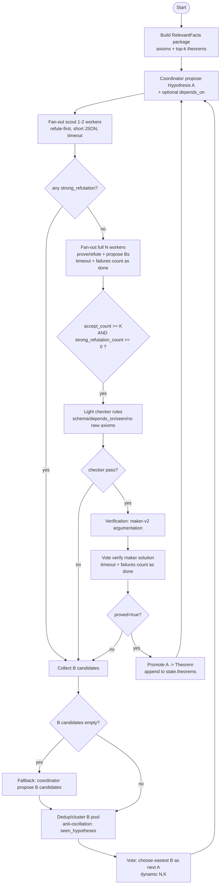
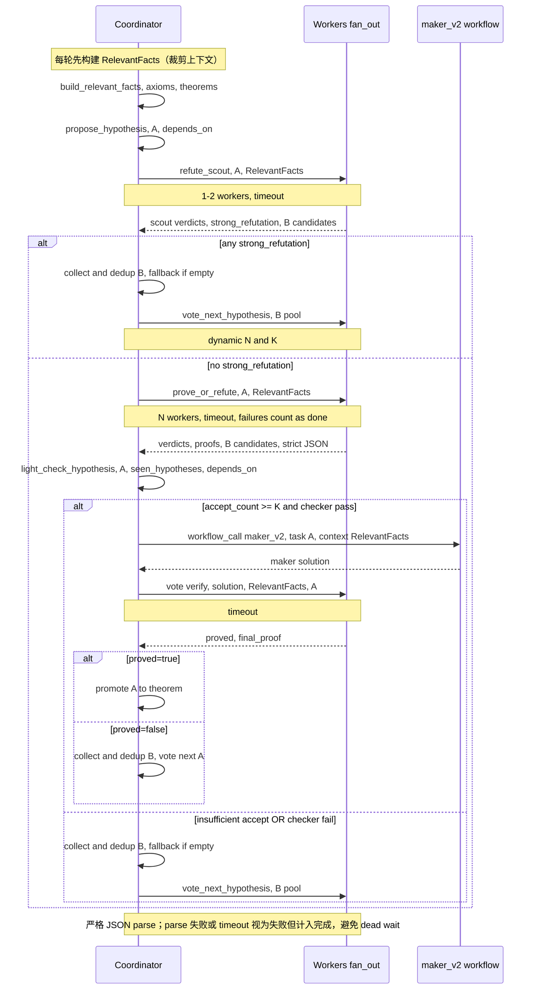

## Hypothesis Promotion Loop（假设升级定理循环）- Workflow Design

目标：在“定理发现”过程中显式引入 **Hypothesis(假设)**，先探索、再验证、最后升级为 **Theorem(定理)**。

这条 workflow 基于 `axiom_theorem_loop.yaml` 的结构（coordinator 提案 + workers 并行 + vote 共识），但把“候选命题”的生命周期拆成两段：

- **探索阶段**：workers 先判断候选假设 A 是否“看起来成立”（并给出证明或反例/漏洞）
- **验证阶段**：只有当探索阶段达到 **accept_count >= K 且无 strong_refutation**，才用 MAKER 做结构化论证验证；验证通过才升级为定理
- **护栏（必须）**：所有 `fan_out` 必须配置 **total timeout + idle timeout**，并把失败/超时计入完成；每轮用 **RelevantFacts** 裁剪上下文，避免 token 随定理库增长而爆炸

---

### 核心角色

- **Coordinator**
  - 提出当前假设 A（Hypothesis A）
  - 收集 workers 的判断结果
  - 决策：进入验证阶段 vs 进入投票阶段
  - 负责状态更新：A 的升级/替换、历史记录、终止条件

- **Workers (N = 2K - 1)**
  - 对 A 给出：证明 / 反例 / 缺失前提
  - 若认为 A 不成立：基于 A 的方向提出替代假设 B（可多个）
  - 在投票阶段：对候选 B[] 进行“最容易得到/最可能成功”的投票

---

### 状态数据（建议的 state 结构）

> 说明：这里只定义 **最小必须字段**，避免复杂化；字段名保持 snake_case 与现有风格一致。

```json
{
  "axioms": ["O1: ...", "O2: ..."],
  "theorems": [
    { "id": "T1", "statement": "...", "proof": "...", "depends_on": ["O1"] }
  ],

  "current_hypothesis": { "id": "H7", "statement": "...", "motivation": "..." },
  "iteration": 7,
  "max_iterations": 200,

  "accept_threshold": { "mode": "k", "k": 3 },
  "seen_hypotheses": [],

  "last_worker_verdicts": [],
  "last_b_pool": [],
  "history": [],

  "done": false,
  "status": "running"  // running | completed | failed | limit
}
```

---

### Worker 输出（探索阶段：prove/refute A）

建议让 fan_out 的 worker **输出 JSON（而不是纯文本）**，从而 coordinator 可以“无额外 LLM 调用”做确定性决策：

```json
{
  "worker_id": "worker-0",
  "accept": true,
  "strong_refutation": false,
  "confidence": 0.75,
  "proof": "短步骤证明 ...",
  "gap_or_counterexample": "",
  "proposed_b": [
    { "statement": "Hypothesis B1 ...", "motivation": "..." },
    { "statement": "Hypothesis B2 ...", "motivation": "..." }
  ]
}
```

- **accept=true**：必须给 `proof`（强制短格式：例如最多 6–10 步，每步只写“引用 id + 一句话”，禁止复述全量上下文）
- **accept=false**：必须给 `gap_or_counterexample`，并建议给 `proposed_b[]`
- **strong_refutation=true**：表示“强反例/致命漏洞”（即使 accept_count ≥ K，也应阻止进入验证阶段）
- **严格 JSON**：输出必须是可解析 JSON；coordinator 对 **parse error / timeout** 必须 **red-flag**，并把该 worker 视为失败但计入完成（避免 fan_out dead wait）

---

### 关键护栏（防硬卡 + 省 token，直接落地到流程里）

这几个点不是“优化”，而是 **保证系统不死等、不空转、能长期跑** 的必要条件：

- **RelevantFacts 裁剪（优先级最高）**：
  - 每轮只给 workers/validator 一个“相关事实小包”，不要把全部 axioms/theorems 全量塞回 prompt。
  - 选取方式：
    - Option 1：`propose_hypothesis` 让 coordinator 同时给出 `depends_on`（或检索线索），证明/验证阶段只提供这些依赖的 statement + 少量邻居。
    - Option 2：用 embedding/相似度检索 top‑k theorems（例如 10–30 条）作为 RelevantFacts，再加 axioms。

- **两段式 fan_out + 早停（先反证，再全量）**：
  - 先跑 1–2 个“反证 scout worker”短输出找 `strong_refutation`；命中立刻进入 B pool，不再跑全量证明。

- **动态调度 N/K（把共识当预算旋钮）**：
  - 对低风险 A 用更小 N/K 快速推进；争议大/高价值 A 再提高 N/K 或升级到验证阶段。

- **fan_out 必须可终止（防硬卡）**：
  - 每个 worker LLM call 必须有 **total timeout + idle timeout**。
  - coordinator 的完成计数必须把 **失败/超时/解析失败** 也算完成，否则一个坏 worker 会卡死全局。

- **分级验证（不要一上来就跑 maker-v2）**：
  - 轻量 checker（纯规则/确定性）：schema、depends_on 是否存在、是否引入新假设/新公理、引用一致性、重复命题、循环依赖等。
  - 仅对通过轻量 checker 的 A 才进入 maker-v2 + 严格 vote 验证。

- **强去重与防抖动（避免 A/B 震荡与重复证明）**：
  - `seen_hypotheses` 存 normalized/hash；B pool 先去重/聚类再投票；winner 若重复则跳过/回退生成新的候选。

- **输出长度硬约束（从源头省 token）**：
  - 探索阶段 proof 强制短格式（最多 N steps），validator 也只允许输出结构化结论（proved + final_proof + depends_on）。

---

### 流程（按你提出的 1–5 步）

#### 1) Coordinator 提出假设 A →（两段式）workers 先反证、再探索
- `build_relevant_facts`（coordinator / deterministic）：生成 RelevantFacts（axioms + top‑k theorems），并在本轮所有 LLM 调用复用
- `propose_hypothesis`（coordinator / llm_call / json）：产出 A（可带 `depends_on`/检索线索，用于裁剪上下文）
- `refute_scout`（fan_out / 1–2 workers / json）：短输出找 `strong_refutation`；**命中立刻早停** 进入 B pool
- `prove_or_refute_with_workers`（fan_out / N workers / json）：全量探索；必须配置 **total timeout + idle timeout**，且 **失败/超时计入完成**

#### 2) Workers 对 A 的分支行为
- 若认为 A 对：输出 proof
- 若认为 A 不对：输出 gap/counterexample，并根据 A 的方向提出 `B[]`
- 若遇到“致命反例/不可修复漏洞”：设置 `strong_refutation=true`（用于阻止进入验证阶段）
- 任何输出若 **无法严格 JSON parse**：必须被 coordinator 标红并视为失败结果，但仍计入完成（避免硬卡）

#### 3) Coordinator 收集结果 → 分流
- 计算 `accept_count` 与 `strong_refutation_count`
- 若 `refute_scout` 已命中 `strong_refutation=true`：直接进入 B pool（跳过全量探索）
- **进入验证阶段条件（默认推荐）**：
  - `accept_count >= K`（K 来自 vote 参数；或使用 state.accept_threshold.k）
  - 且 `strong_refutation_count == 0`
  - 且通过 **轻量 checker**（schema/依赖存在/不引入新假设/引用一致性/重复与循环依赖等）
- 否则：
  - 汇总所有 workers 的 `B[]`（去重/聚类）→ 进入投票阶段
  - 若 `B[]` 为空：走 fallback 生成少量候选，再投票（避免流程直接断掉）

> 说明：从 unanimous 改成 “≥K 且无强反例” 的目的，是减少软卡（长期进不了验证），把可靠性压力交给验证阶段去兜底。

#### 4) 验证阶段（MAKER 拆分论证）→ A 升级为定理
目标：把“看起来对”变成“可复现的结构化论证”。

建议实现为三步：

- `light_check_hypothesis`：纯规则/确定性检查（通过才进入 maker，避免浪费 token）
- `maker_argumentation`：`workflow_call` 调用 `maker-v2`（context 优先用 RelevantFacts，而不是全量 axioms/theorems）  
  输入 task 形如：
  - RelevantFacts（axioms + top‑k theorems，可 json 附在 context）
  - 当前假设 A
  - 任务目标：产生一份结构化论证（maker 的 `solution` 输出）

- `verify_maker_solution`：`vote` + `llm_call`（workers 严格验证；同样需要 timeout + failure-count-as-done）
  - 输入：RelevantFacts + A + maker solution
  - 输出（json）：`proved: bool`, `final_proof: string`, `depends_on: [string]`

若 `proved=true`：
- `update_state_promote_theorem`：把 A 写入 `theorems[]`，并从 Hypothesis 升级为 Theorem

#### 5) 投票阶段（从 B[] 里选“最容易得到”的）→ 作为新的 A
目标：在“失败分支”里仍然有明确的收敛策略：从 B[] 里挑一个最容易成功的候选继续推进。

建议实现：

- `dedup_cluster_b_pool`：先对 B[] 去重/聚类（normalize；可选 embeddings similarity），并明确选择标准（依赖最少/最贴近 RelevantFacts/步骤最短）
- `vote_next_hypothesis`：`vote` + `llm_call`  
  输入：聚合后的 `B[]`（去重后）  
  让 workers 输出一个 winner：

```json
{ "statement": "chosen hypothesis", "reason": "why easiest" }
```

- `set_current_hypothesis`：更新 state.current_hypothesis = winner，继续下一轮
- 额外护栏：winner 若命中 `seen_hypotheses`（重复），则跳过并选择下一个；若全重复，fallback 生成新的候选（防抖动）

---

### Mermaid 流程图（状态机视角）



---

### Mermaid 时序图（事件/调用视角）



---

### 终止条件（建议）

- **iteration >= max_iterations / max_depth**：`status="limit"`，停止
- **B[] 为空且无法产生新 A**：`status="failed"`（或回退到 coordinator 生成一个新 B 作为恢复策略）
- **任何 fan_out 不允许无限等待**：必须有 timeout；超时/失败要计入完成（否则会硬卡）

---

### 与现有系统的对齐点（实现时会用到）

- **并行**：`fan_out`（workers）
- **共识**：`vote`（first-to-ahead-by-k）
- **验证阶段**：`workflow_call` → `maker-v2`，再 `vote` 做严格验证
- **节点类型标注**：
  - Hypothesis A / candidates B：记为 `Hypothesis`
  - 验证通过后：升级为 `Theorem`

---

### MAKER 在定理证明场景的适配与提示词思路（补充）

参考：MAKER/MDAP 框架（Maximal decomposition + first-to-ahead-by-k voting + red-flagging），见论文 [Solving a Million-Step LLM Task with Zero Errors](https://arxiv.org/html/2511.09030v1)。

#### 1) 适配结论：什么时候“适合”

- **适合**（推荐用）：
  - 证明任务可以被拆成**可判定的微结论**：依赖集合、下一步推导是否合法、是否引入新假设、引用是否存在、是否矛盾等。
  - verifier 能输出**结构化裁决**（而不是作文），使 coordinator 能无额外 LLM 做分流/早停/重试。

- **不适合 / 需要加硬件**（否则投票只提升“共识”，不保证“正确”）：
  - 需要严格数学正确性但缺少 **形式化 checker** 或强规则 checker；此时把“可判定性”尽量前置到轻量 checker/红旗规则里，降低幻觉空间。

#### 2) Prompt 构建的核心：把 MAKER 三件套落地成“可控输出”

- **Maximal decomposition（极致分解）**：
  - 把“证明”拆成机器能审计的步骤：`depends_on` → `proof_skeleton` → `step_i`（每步只允许引用已知 id）→ `consistency_check`。
  - **生成侧**与**判别侧**分离：生成可以发散，判别必须收敛（只做裁决与列举红旗）。

- **First-to-ahead-by-k voting（把投票投在可判定标准上）**：
  - 不要只对“整篇 proof 看起来像不像”投票；要对微结论投票：这一步是否有效、这个依赖是否必要、是否存在强反例等。
  - 票规写死（硬约束优先）：出现任何红旗 -> 直接 fail；否则才比较候选的“最短/最少依赖/最贴近 RelevantFacts”。

- **Red-flagging（红旗是控制流，不是日志）**：
  - 红旗触发后必须进入固定恢复路径：`repair_output`（只修 JSON）→ `retry_with_constraints`（更强约束/更短输出/换策略）→ `fallback_to_B_pool`（换假设）。
  - 目标是减少“相关错误”（大家一起错）并及时止损，避免把错误带入后续 maker/verify 的重成本阶段。

#### 3) 提示词与输出的硬约束（推荐直接写进 system prompt）

- **输出必须严格 JSON**：`Return ONLY valid JSON. No markdown. No extra keys.`
- **禁止引入新假设/新公理/新定义**：若必须引入，则 `accept=false` 并写入红旗。
- **每一步必须显式引用 id**：proof 的每步都要列 `cited_fact_ids`，只允许来自 `axioms/theorems/relevant_facts`。
- **长度硬约束**：proof/verification 都给 `max_steps` 与 `max_chars`（宁可短而不全，也不要长作文）。
- **RelevantFacts 只给小包**：证明与验证一律使用裁剪后的 RelevantFacts（避免定理库增长导致 token/错误率同时上升）。

#### 4) 定理证明场景的高收益红旗清单（建议 verifier 必检）

- **new_assumption**：出现“设/令/不妨/显然”但无法落到已知 facts
- **undefined_symbol**：使用未在上下文中定义的符号/术语
- **missing_reference**：引用了不存在的 id，或 `cited_fact_ids` 与文本不一致
- **jump_step**：单步跨度过大（无法在 1–2 句内解释为已知推理规则）
- **contradiction**：与 axioms/theorems 或同一 proof 内部自相矛盾
- **format_error**：非严格 JSON、字段缺失、超长/截断（视为失败但计入完成，避免硬卡）

#### 5) 去相关（decorrelate）建议：让投票真正“纠错”

- **角色去相关**：为不同 worker 固定不同证明策略：direct / contradiction / induction / counterexample hunter / missing-premise hunter。
- **约束去相关**：同一任务让不同 worker 采用不同输出偏好（更短 proof vs 更严谨引用），用 verifier 统一裁决。
- **采样去相关**：必要时用不同温度/不同模型（如果可用）；否则投票容易变成“集体同错”。

---

### 可选：引入形式化验证（Lean）作为“最终硬门”

如果你希望把 “vote 通过 + 看起来像证明” 升级到 **“内核可检查的证明”**，最有效的办法就是把形式化验证器（例如 Lean）接到流程里：  
**只要 Lean 通过，就把该定理视为“在既定公理系统下”严格成立**；Lean 不通过，则视为强红旗并回退到修复/换假设路径。

#### 0) 工具选型建议（结合当前 .NET 10 + Workflow/YAML 技术栈）

你们当前的技术栈是 **C#/.NET 10** 主工程 + **工作流引擎（YAML）** 编排，因此最现实的落地方式是：  
要么用 **.NET 原生可嵌入的求解器库**，要么用 **外部 CLI 工具**（由 workflow step/tool 以进程方式调用，并带 timeout）。

- **首选（短期最稳）：SMT 求解器 Z3**  
  - **为什么适合**：Z3 有成熟的 .NET 集成路径（NuGet/本地 native），执行确定性、速度快，特别适合做你文档里提到的 **弱 checker**（找矛盾/找反例/检查可判定子集）。  
  - **适用前提**：必须先把一部分 axioms/theorems 落到一个可形式化的子语言（哪怕很小），否则自然语言无法直接喂给求解器。

- **强验证（中长期）：Lean4（或同类 proof assistant）作为最终 gate**  
  - **为什么适合**：如果目标是“数学意义上的证明”，最终仍需要 proof assistant 的内核检查；Lean 不必嵌入 .NET，只需作为 CLI 工具被调用即可。  
  - **工程核心**：NL → Lean 的映射与 `FormalFacts` 资产沉淀（逐步扩展形式化覆盖面）。

- **补充（偏程序正确性而非定理）：Dafny**  
  - 如果你要形式化验证的是你们 C# 里的算法/状态机（例如某些关键 reducer/route 逻辑），Dafny 更对口；但它不是为“自然语言定理证明”设计的。

- **补充（偏系统行为/并发正确性）：TLA+ / model checking**  
  - 如果你要验证的是“工作流不会死锁、预算护栏一定触发、事件传播满足安全性/活性”等系统级性质，TLA+ 更合适；它通常是离线建模验证，不直接参与每轮推理。

#### 1) Lean 能为系统做什么（对齐你的工作流）

- **把 verifier 从“作文裁判”升级为“可判定裁判”**：
  - `verify_maker_solution` 仍然有价值（过滤明显错误/不一致/隐含假设），但它本质仍是 LLM judgement。
  - **Lean 是确定性的**：通过=证明脚本可被内核检查；失败=给出精确错误信息，便于定向修复（例如缺失引理/类型不匹配/目标无法归约）。

- **把“红旗”变成强信号**：
  - Lean 报错信息本身就是高质量 red-flag，可直接驱动 `repair` 或 `fallback_to_B_pool`。

- **让错误去相关更容易**：
  - 多个 worker 可能“集体同错”，但 Lean 作为外部裁判能把相关错误一刀切掉（这也是 MAKER/MDAP 强调 red-flagging 的方向之一）。

#### 2) 推荐集成位置（最省钱、最有效）

- **建议作为最终 gate**：放在 `verify_maker_solution` 之后、`update_state_promote_theorem` 之前。  
  原因：Lean 成本（工程+推理 token）更高，应该只对“高潜候选”启用。

- **建议先从小域开始**：
  - 先支持一个可形式化的子集（例如等式推理/命题逻辑/一阶可判定片段），逐步扩展，不要一开始就想把自然语言数学全塞进 Lean。

#### 3) Prompt 设计原则（让 Lean 变成可控工具，而不是另一个 LLM 黑箱）

- **输入必须是“可形式化上下文”**：
  - 你当前的 `axioms/theorems` 是自然语言字符串时，必须增加一层 **FormalFacts**（哪怕很小）：为每条可用事实提供 Lean 版表达式与 id 对应关系。
  - Recommended pattern：`relevant_facts[]` 同时携带 `id + nl_statement + lean_statement`。

- **输出必须是“可执行 Lean 代码”**（建议单文件、最小 import）：
  - 要求 worker 输出仅包含 Lean 代码（或 JSON 中单字段 `lean_code`，由 coordinator 抽取后运行）。
  - 禁止输出 markdown/解释性文字，避免工具链解析失败。

- **强约束策略空间，减少幻觉**：
  - 固定证明风格：`by` + 少量允许 tactic（例如 `simp`/`aesop`/`linarith` 等），禁止自由发挥长脚本。
  - 每次只证明一个 lemma/theorem，减少上下文污染。

#### 4) 把 Lean 失败当成“结构化红旗”（建议直接写入状态机）

推荐把 Lean 运行结果归一化成这些字段（供 coordinator 决策）：

- `formal_verified: bool`
- `lean_errors: [string]`（截断 top-k 行）
- `red_flags: [string]`（例如 `type_mismatch`, `missing_lemma`, `cannot_close_goal`, `timeout`, `nonterminating_tactic`）

然后在控制流里：

- `formal_verified=true`：允许 `Promote A -> Theorem`
- `formal_verified=false`：进入 `repair`（基于错误信息补引理/改步骤）或回退到 B pool

#### 5) 重要注意事项（不说清楚一定踩坑）

- **Lean 证明的是“相对正确性”**：只在你提供的公理/定义体系下成立；如果体系不一致，原则上可以推出任何命题（需要额外的一致性约束/审计策略）。
- **自然语言到 Lean 的映射是工程核心**：别指望一次 prompt 解决；应把 FormalFacts 当作系统资产逐步积累。
- **工具链要有 timeout**：和 fan_out 一样，Lean 执行也必须有 timeout + 失败计入完成，避免硬卡。

#### 6) 推荐工程形态：做一个 “Lean Executor” MCP Server（stdio / docker）

你们的 Agent 已经支持通过 MCP 调用外部工具（stdio / docker / http），因此把 Lean4 放到 **独立 MCP Server** 里是很自然的集成方式：

- **为什么值得做**：
  - **隔离环境**：Lean4/lake/mathlib 依赖与主进程解耦，升级/缓存不影响主工程。
  - **跨运行时一致**：Local/Orleans/ProtoActor 下都可用同一个工具入口（工具是外部进程）。
  - **安全与配额更好控**：统一在 MCP server 侧做 workspace 隔离、timeout、输出截断与资源限制。

- **建议暴露的最小工具集**：
  - `lean_check`：输入 `lean_code`（或 `file`），在受控工程目录中编译检查，返回 `formal_verified` 与 `lean_errors[]`。
  - `lean_version`：回传版本信息（用于诊断环境漂移）。
  - （可选）`lake_build`：在固定工程内构建/预热依赖（只允许白名单目标）。

- **强制护栏（必须有）**：
  - 每次执行在 **临时目录**（或每 session 独立目录）完成，禁止任意路径读写。
  - CLI 调用必须有 **timeout**，超时强制 kill，并把 `timeout` 作为 red-flag。
  - 禁止 `sorry/admit/axiom`（MCP server 可做简单静态扫描 + red-flag）。
  - 输出必须截断（避免 Lean 输出过长导致上游卡住）。

---

### 附录：最坏情况会“卡”在哪里（Failure Modes，已融入流程与图）

这里的“卡”分两类：

- **硬卡（dead wait）**：在某个步骤等待永远不返回（系统看起来完全不动）
- **软卡（空转/震荡）**：流程在 A/B 或投票阶段循环推进，但长期产不出定理（看起来“推不出来”）

#### 1) 硬卡：`fan_out` 等最后一个 worker 回来

最常见的死等点：`prove_or_refute_with_workers`（探索阶段）或验证阶段里的任何 `fan_out/parallel`。

触发条件：
- 某个 worker 的 LLM 调用永远不结束（stream 不 complete、provider hang、网络卡死）
- worker 进程/actor 崩了但 coordinator 仍在等待结果

缓解策略（设计层）：
- 为 worker LLM call 设置 **total timeout + idle timeout**（否则 fan_out 永远等不到 terminal event）
- coordinator 对 fan_out 的“完成计数”必须把失败也算完成（否则一个失败子任务会把全局卡住）

#### 2) 软卡：门槛过高/规则不清，导致长期进不了验证阶段

最坏情况（旧设计常见）：如果使用 **unanimous** 作为门槛，只要有 1 个 worker 反对，就会永远在投票阶段来回换 A。

缓解策略（设计层，当前推荐）：
- 使用 **≥K accept 且无“强反例”** 进入验证阶段（accept_count>=K && strong_refutation_count==0）
- 在 state 里维护 `seen_hypotheses`（statement 的 hash/normalized form），避免重复选回同一个 A

#### 3) 软卡：投票阶段 B[] 质量差/重复多，导致“抖动选 A”

触发条件：
- workers 产出的 B[] 互相高度相似/重复，投票结果不稳定
- B[] 没有“可验证的难度/依赖”信息，投票只能靠主观判断

缓解策略（设计层）：
- 对 B[] 先做去重/聚类（按字符串 normalize；若启 embeddings，用 similarity 聚类）
- 在 vote 输入里明确“选择标准”：优先依赖最少、最接近已知 axioms/theorems、步骤最短

#### 4) 失败型卡点：B[] 为空且没有 fallback（流程无法继续）

触发条件：
- worker 都 reject 但没有提出任何 B
- 或 B 全被过滤掉（空）

缓解策略（设计层）：
- 增加一个 `propose_fallback_b`（coordinator llm_call）在 B 为空时生成少量候选，避免直接 failed

#### 5) 失败型卡点：JSON/结构化输出解析失败导致步骤失败

本 workflow 强依赖 JSON 输出（尤其是 worker verdict JSON）；最坏情况是：
- 输出不是严格 JSON（例如 LaTeX 反斜杠）→ parser fail → step failed → workflow 终止或回退

缓解策略（设计层）：
- 对关键 JSON step 打开 **strict_parse + red-flag**（失败要显式可见，不要带病前进）
- 对输出 schema 强约束：字段必须齐全；proof 放 text 字段但保持 JSON 合法

---

### 附录：Token 预算优化清单（已融入流程与图）

目标：在尽可能不浪费 token 的前提下，让多 agent 协作推导出更多 **正确** 定理。

#### B) RelevantFacts 检索/裁剪（优先级最高）

- **思路**：每轮只给 workers/validator 一个“相关事实小包”，避免把全部 axioms/theorems 全量塞回 prompt。
- **实现选项**：
  - **Option 1（最简单）**：coordinator 在提出 A 时给出 `depends_on`，证明/验证阶段只提供这些依赖的 statement + 少量邻居。
  - **Option 2（更稳）**：用 embedding/相似度检索 top‑k theorems（例如 10–30 条）作为 RelevantFacts，再加 axioms。
- **收益**：随着定理库增长，单轮 token 仍接近常数，系统可长时间运行而不爆上下文。

#### 1) 两段式 fan_out + 早停（先反证，再全量）

- **做法**：先让 1–2 个“反证 worker”短输出找 `strong_refutation`；命中立刻进入 B candidates 投票，不再跑全量证明。
- **收益**：把错误 A 的成本从 N 倍降到 1–2 倍。

#### 2) 动态调度 N/K（把共识当预算旋钮）

- **做法**：对低风险 A 用更小 N/K 快速推进；争议大/高价值 A 再提高 N/K 或升级到验证阶段。
- **收益**：同预算下提高吞吐量，让 token 花在“更可能成功”的候选上。

#### 3) 分级验证（不要一上来就跑 maker-v2）

- **做法**：验证阶段分两层：
  - 轻量验证：schema/依赖存在/是否引入新假设/引用一致性
  - 重验证：仅对通过轻量验证的 A 才 workflow_call → maker-v2
- **收益**：把重预算集中在少数高潜力候选上。

#### 4) 强去重与防抖动（避免 A/B 震荡与重复证明）

- **做法**：维护 `seen_hypotheses`（normalize/hash）；B candidates 先去重/聚类再投票；winner 若重复则跳过/回退。
- **收益**：避免把 token 浪费在“同义命题反复验证”上。

#### 5) 输出长度硬约束（从源头压缩 token）

- **做法**：探索阶段 proof 强制短格式：最多 N steps、每步只写 “引用 id + 一句话”，禁止复述全量上下文。
- **收益**：workers 输出从“长作文”变成“结构化证据”，大幅降低总 token。

#### 6) 引入弱 checker（低成本提升正确率）

- **做法**：先用规则检查挡掉明显无效（新假设/依赖不存在/循环依赖/重复命题），再把少量候选交给 LLM 深验证。
- **收益**：正确率上升，同时减少无意义的后续 fan_out/verify token 消耗。


